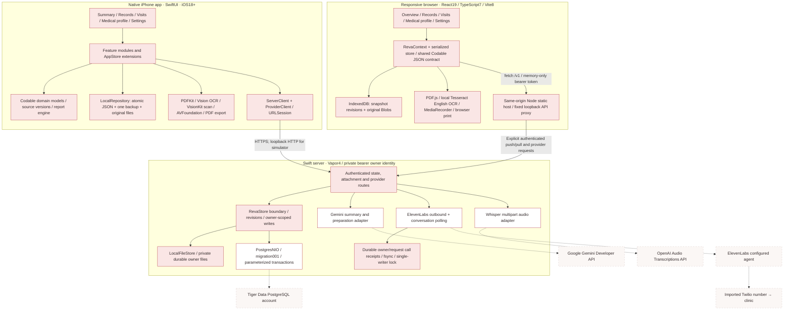
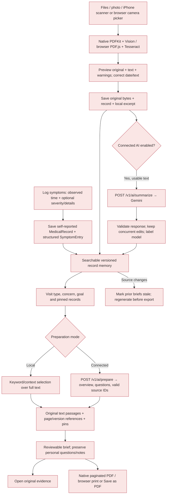
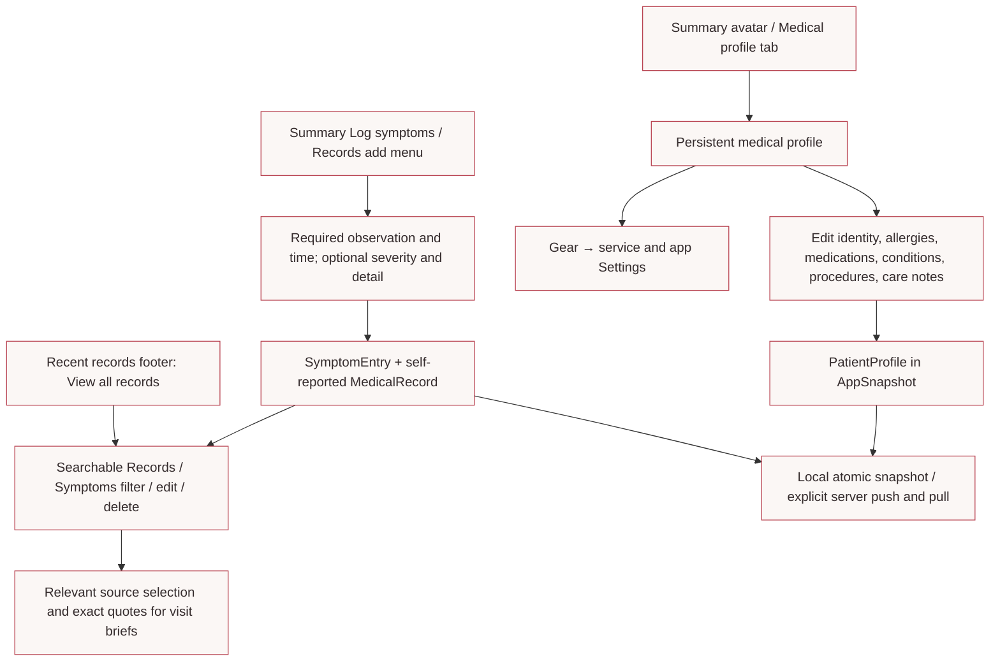
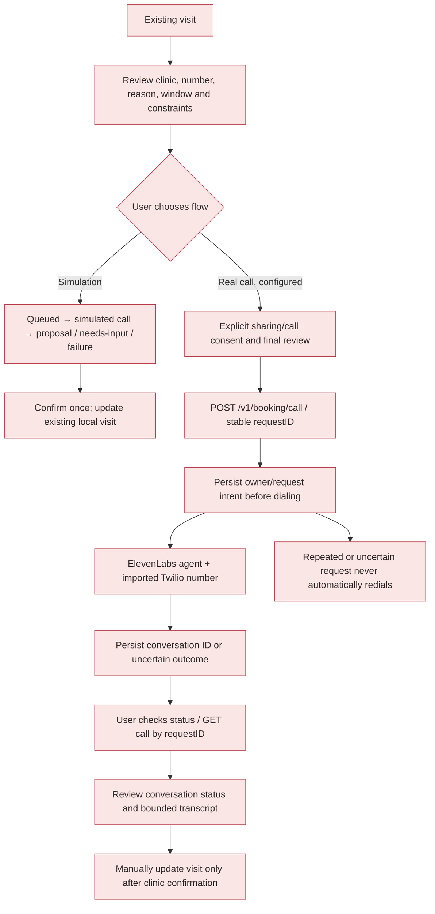
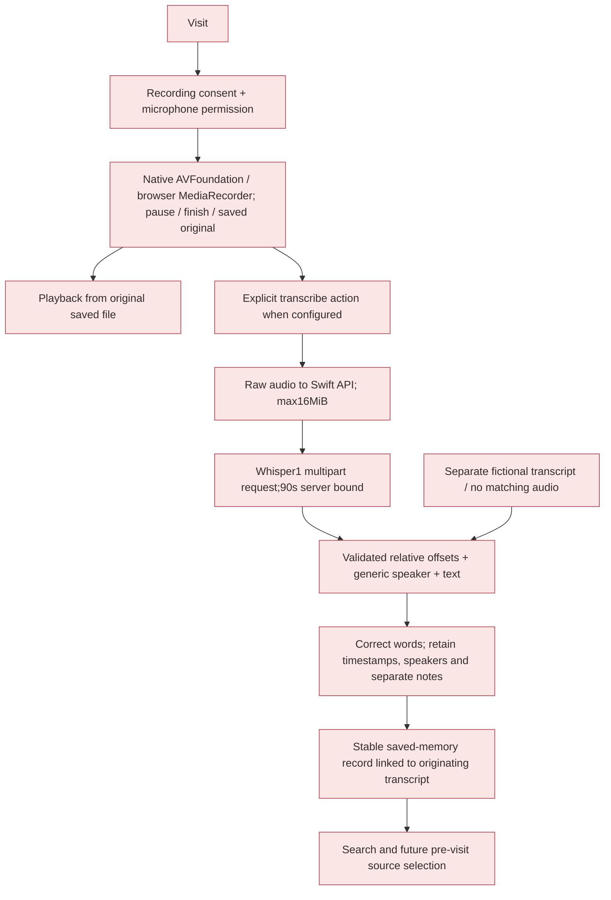
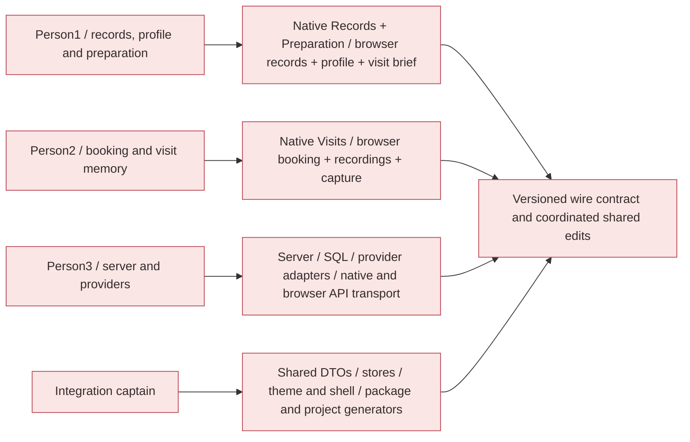

# Reva — as-built MVP stack

**September 12, 2026 · browser implementation checkpoint `2640360` · current diagram updated before the documentation push.**

Reva has a native SwiftUI iPhone app, a responsive React browser client, and a shared Swift server. Both clients run the same fictional local demo and retain source provenance. Provider adapters are implemented and tested with mocks; their accounts/credentials and a live Tiger database remain manual setup. The app never needs provider keys to demonstrate the local patient journey. The [revised MVP goal](mvp-goal.md), [setup guide](../README.md), [API contract](task-specs/mvp-api-contract.md), and [verification evidence](verification/README.md) define the delivered scope.

For a shareable teammate handoff, use the [seven-page project overview packet](../output/pdf/reva-project-overview-packet.pdf) or its [editable source](project-overview-packet.md). It records the inspected worktree inventory, proposed ownership split, functionality matrix, and setup guide at baseline `d0af1df`. The [coding standard](coding-standard.md), [browser guide](../apps/web/README.md), and current team guide describe the later source-file split and browser extension; the baseline PDF is historical.

## Full stack at a glance

Petal nodes work locally. White nodes with red outlines are implemented provider/database boundaries that need configuration. Dashed nodes are external accounts or infrastructure that have not been activated by this build.

Each client remains locally authoritative between sync operations. Its server snapshot transfers are explicit push/pull actions; they are separate from individual AI or calling requests. Neither client connects directly to PostgreSQL. The browser is a separate interface using the existing wire contract, not a SwiftUI-to-web compilation. Its production host permits only current API routes and a fixed loopback destination; HTTPS termination is a hosting setup step. Provider responses update local state only after validation, and generation checks protect source/visit edits made while a request is running.

## Stack inventory

| Layer | Actual implementation | Entry point / setup |
| --- | --- | --- |
| Native app | Swift6.3 compiler, SwiftUI, iOS18 deployment target; verified Xcode26.4/iOS26.4 simulator | [RevaApp.swift](../apps/ios/Reva/RevaApp.swift), [Xcode project](../Reva.xcodeproj) |
| Design | Selected blush ivory `#FBF7F5`, white, heart red `#B84250`, deep red `#8C2F3B`, petal `#FAE6E5`, linen `#DBCBC9`; fixed light appearance | [Theme](../apps/ios/Reva/Features/Shared/Theme.swift), [source palette](../design/palette.json) |
| Browser | React19.3.0, TypeScript7.0.2, Vite8.3.0, lucide-react1.45.0; desktop sidebar/two-column layout and mobile bottom navigation | [Browser guide](../apps/web/README.md), [app shell](../apps/web/src/App.tsx) |
| Browser state and devices | IndexedDB revisions/Blobs; PDF.js6.3.289; Tesseract.js7 with local English assets; MediaRecorder; print CSS | [Core](../apps/web/src/core), [records](../apps/web/src/features/records), [visits](../apps/web/src/features/visits) |
| Browser hosting | Node24 verified; static dist + bounded same-origin loopback proxy; no arbitrary external target or client provider keys | [serve.mjs](../apps/web/scripts/serve.mjs), [HTTP regression suite](../apps/web/scripts/serve.test.mjs) |
| State/domain | Codable snapshots, record versions, source-page references, visit/report/question authority, booking and recording state | [Core](../apps/ios/Reva/Core), [focused AppStore extensions](../apps/ios/Reva/State) |
| Local storage | App Support JSON state with atomic save/backup; original documents/audio stored separately | [LocalRepository.swift](../apps/ios/Reva/Core/LocalRepository.swift) |
| Document intake | Files/PhotosUI, PDFKit embedded text, Vision OCR, VisionKit supported-device scanner; review warnings and bounded inputs | [Device adapters](../apps/ios/Reva/Device) |
| Recording/export | AVFoundation capture/playback, timestamped transcript UI, UIKit/CoreText PDF pagination, PDFKit/QuickLook preview and native sharing | [Visit features](../apps/ios/Reva/Features/Visits), [ReportPDFRenderer](../apps/ios/Reva/Device/ReportPDFRenderer.swift) |
| Native HTTP | Foundation URLSession; explicit bearer token; HTTPS except loopback; provider secrets stay on server | [ServerClient](../apps/ios/Reva/Core/ServerClient.swift), [ProviderClient](../apps/ios/Reva/Core/ProviderClient.swift) |
| Swift backend | Vapor4.122.1, bounded authenticated routes, safe errors and owner-scoped data access | [HTTP.swift](../server/Sources/RevaServer/HTTP.swift), [server package](../server/Package.swift) |
| Database | PostgresNIO1.33.1, TLS verification, migration001; JSONB snapshots, BYTEA originals and mutation audit | [PostgresStore](../server/Sources/RevaServer/PostgresStore.swift), [SQL](../server/Sources/RevaServer/Migrations/001_snapshot.sql) |
| Document/visit AI | Gemini Developer API `generateContent`; default `gemini-2.5-flash`, configurable `GEMINI_MODEL`; structured JSON validation | [Gemini provider files](../server/Sources/RevaServer/Providers/GeminiService.swift) |
| Speech AI | OpenAI `whisper-1`, multipart `verbose_json`, segment timestamps and generic speaker labels | [Whisper adapter](../server/Sources/RevaServer/Providers/VoiceTranscription.swift) |
| Calling | ElevenLabs Twilio outbound endpoint and conversation status API; durable replay receipts; no automatic appointment confirmation | [VoiceCalls.swift](../server/Sources/RevaServer/Providers/VoiceCalls.swift) |
| Configuration | Root `.env` delivered empty and ignored; optional safe dotenv launcher; exported environment overrides file values | [run_server.py](../scripts/run_server.py), [example](../.env.example), [provider setup](../server/README.md#configurable-mvp-providers) |

The verified Gemini default uses a current documented model ID. The earlier planning names are not assumed available: choose a model your account supports through `GEMINI_MODEL`. The selected MVP speech path is Whisper; local Whisper and Google Speech-to-Text are alternatives for later work, not extra hidden integrations. Official API references are linked in the [server guide](../server/README.md) and adapter source.

## Documents → memory → visit brief

Local excerpts quote source wording; authored fictional summaries are labeled separately. Connected summaries/overviews identify the model and require review. Gemini selects only supplied IDs; the client constructs original-source quotes and page references. OCR is reviewable, with explicit uncertainty; perfect extraction is not claimed. Imported unreadable text remains a needs-review record rather than pretending AI processing succeeded.

## Medical profile and symptom entry structure

The medical profile is editable quick-reference data, separate from historical source documents. Optional `surgeriesAndImplants` and `careNotes` fields preserve earlier snapshots. The preparation contract currently uses records, so profile edits do not silently rewrite evidence. User symptom entries contain their structured observation and exact labelled source text; edits preserve identity and creation time while the usual source versioning marks prior briefs stale. Full ISO occurrence time and time zone are preserved, and the record list uses the observation's local calendar day.

Both clients now use exact blush ivory `#FBF7F5`, white outlined cards, and heart-red `#B84250` actions. Small labels on petal use deep red `#8C2F3B`. The [browser verification](verification/web-client.md) records the current responsive pass. The [earlier native follow-up](verification/profile-symptoms.md) preserves historical teal-palette evidence.

## Booking: simulation and configured calls

Calling requires private server tokens, ElevenLabs key/agent/phone-number IDs, `REVA_ENABLE_LIVE_CALLS=true`, and explicit per-request consent. The server passes the reviewed patient/clinic/scheduling variables to the configured agent. It requests provider call recording disabled. Conversation completion is not treated as an appointment confirmation. Uncertain calls need inspection in ElevenLabs before authorizing any new request.

Call receipts live in a persistent server directory even in PostgreSQL mode. A single-writer lock and durable intent protect against duplicate attempts across concurrency and process restarts; keep that directory across deployments. Snapshot deletion does not remove call receipts.

## Recording → transcript → future memory

New audio never receives the sample transcript. Recording pauses when the app leaves the foreground. Existing saved memory updates under its stable ID, while corrections retain source identity and separate notes. Browser media uses a secure context (HTTPS or localhost), capability checks, consent and original codec metadata; WebM/Ogg are accepted by the Swift transport, while playback depends on the receiving device. Physical capture/signing and Safari/Firefox hardware validation remain manual checks; sample and adapter tests provide the deterministic demo.

## Data and ownership boundaries

| Storage | What it holds | Consistency boundary |
| --- | --- | --- |
| iPhone App Support | Medical profile, records including structured symptom entries, visits/reports, bookings, recordings/transcripts; original document/audio files | Atomic snapshot plus one backup; originals are separately written |
| Browser IndexedDB | Native-compatible snapshot, local revision, original document/audio Blobs | Atomic snapshot/CAS and downloaded-original transaction; quota errors visible; no silent reset |
| Local Swift server | Owner-scoped snapshot/revision and bounded attachments | Single writer, atomic owner-file replacement |
| Tiger PostgreSQL | `reva_owner_state` JSONB, `reva_attachments` BYTEA, `reva_mutations` audit | Owner row lock and transactional mutation; parameter binding and verified TLS |
| Server call-receipt directory | Reviewed request, durable intent, conversation ID/status | Owner/request identity, file sync/rename, process lock; retained independently of snapshots |
| Provider services | Only content explicitly submitted for that operation | External account policies and credentials; no automatic account provisioning |

Server snapshot push uses a base revision. Conflict resolution is explicit. Attachment transfers and snapshot commits are separate operations; a failed sync can leave already-copied files, so this MVP does not claim atomic rollback across both. Root `.env` stays untracked. Client access tokens remain in memory for the session; provider keys never enter either client. Browser originals are SHA256-checked before fixture fallback; source IDs, page/version citations and all three demo report hashes match the native engine. See the [compatibility limits](../apps/web/src/core/COMPATIBILITY.md).

## Three-person development map

The [team guide](team-workflow.md) assigns exact files, worktree commands and starter tasks. Feature modules remain one Swift target to keep the MVP simple; separation is by owned folders and focused state extensions. Shared model/wire changes and Xcode project regeneration have one integration owner. Screens/editors now occupy separate files; `BookingEngine` is separate from `ReportEngine`, and provider wire values live in `ProviderContracts`. Every production Swift file and browser source block has a leading responsibility contract and named logical sections, checked by `scripts/check_code_structure.py`; see the [coding standard and block diagram](coding-standard.md).

## Ready now and manual next steps

The native build, local journeys, provider request/response mocks, real local-server auth/persistence checks and native provider-fixture UI have passed. The [verification sheet](verification/README.md) records exact counts and limitations. Before using live integrations, configure private tokens, keys/model access, the ElevenLabs agent and imported Twilio number, a persistent server directory, HTTPS hosting for a physical phone, and Tiger credentials if selecting PostgreSQL; then run a credentialed smoke check with synthetic data. No such live activation was performed here.

The browser extension is implemented and verified locally. MyChart import, custom password encryption, production medical-data deployment and extensive post-MVP polish remain outside this deadline. Checkpoint history and the manual feedback workflow are preserved for the next revisions.
