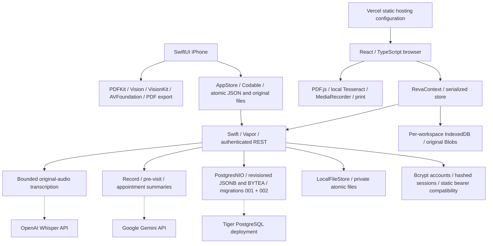
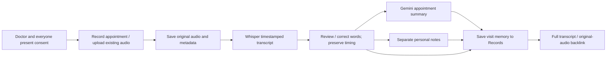
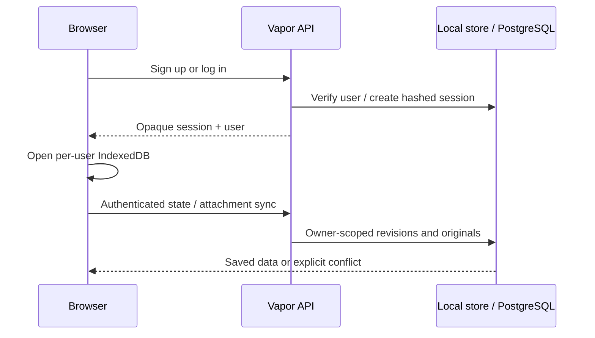

# Reva — as-built architecture

Updated September 12, 2026. The [current scope](reva-stack-spec.md) compares the repository with the [original spec sheet and diagram](reva-stack-spec-planning.md). Appointment calling has been removed; appointment capture, transcription and summaries are the supported post-visit flow. Live provider and Tiger deployment readiness is still unverified.

## Full stack at a glance

Solid arrows show implemented code. Dashed arrows require external configuration and live verification.

The original proposal’s managed identity, cloud buckets, Document AI, Google Speech-to-Text, Cloud Tasks/workers and APNs are not implemented. The browser, custom accounts, local OCR, Whisper and inline provider requests are the actual stack. Provider keys never enter client code.

## Records and preparation

Imports preserve original bytes and page text. Native uses PDFKit/Vision/VisionKit; browser uses PDF.js and local Tesseract. Mixed PDFs retain readable embedded text, bounded OCR and extraction warnings. Exact page excerpts, record versions and source links remain separate from AI summaries. Record edits invalidate affected briefs without replacing newer notes or provider results.

Visit preparation combines relevant original records, pinned sources and the user’s concern/questions. Local preparation works without providers; configured Gemini supplies an overview, questions and validated source selections. Clients construct citations from original text. Native PDF export and browser print retain readable evidence. No model output diagnoses or independently changes treatment.

## Appointment recording and memory

Before capture, both clients display: **Get your doctor’s consent and permission from everyone present before recording.** Recording requires explicit confirmation. Capture supports pause/finish and retains completed audio after save failure. Browser audio and metadata commit atomically in the active account/demo repository. Native keeps a recoverable local file. Fictional sample transcripts are separate from new audio.

Whisper returns recording-relative segments with generic speaker labels; this is not reliable doctor/patient diarization. Appointment summarization uses the complete timestamped transcript, never unrelated personal notes or a truncated local excerpt. Existing recording `summary` stores personal notes. Optional `aiSummary`, `aiSummaryModel`, and `aiSummaryGeneratedAt` store the derived output separately and remain backward-decodable.

Transcript changes invalidate derived AI output. Provider results require the same source and connection context before publication. Saving a memory retains full transcript source text and original recording identity; the optional AI summary is a separate derived view. User notes and source corrections survive provider failures.

## Accounts and Tiger persistence

Browser `/signup`, `/login`, and `/app` use the implemented auth routes. Sessions persist in `reva.session.v1`; account data uses per-user IndexedDB and debounced auto-sync. `/demo` has three isolated fictional profiles and manual sync. Native continues using configured static bearer tokens. Both identity types resolve to an authenticated owner on the server.

Bcrypt work runs off the Vapor event loop. Session tokens are stored as hashes server-side, with expiration, revocation and a 20-live-session cap. Password changes and session issuance share an atomic user check. Local `.accounts.json` avoids valid owner filenames; shape-checked migration preserves old registries and static owner data. PostgreSQL account/session tables and owner state are separate, parameter-bound and transactional.

Native snapshots use atomic JSON plus a backup and separate original files. Browser snapshots/originals use revision-checked IndexedDB transactions. Server local storage uses owner files; PostgreSQL uses JSONB snapshots and BYTEA attachments. Network attachment transfers and snapshot commits are separate requests, so cross-request sync is not a single transaction.

The legacy `bookings` array remains inert for old snapshot compatibility. Call execution, simulation, routes, settings and provider integration have been removed. Historical user data is retained without a destructive migration.

## Time, hosting and verification

Both clients default to `America/Chicago`, following CST/CDT. Existing explicit zones remain authoritative. Date-only record dates and birthdays retain their calendar date, while absolute timestamps remain ISO/UTC on the wire.

The root Vercel configuration builds the browser. The production web bundle needs a configured HTTPS API origin plus matching CSP/CORS; local development uses a fixed loopback proxy. The server Dockerfile and Tiger provisioning/setup path exist. A successful build or push does not prove a deployed API, live database or provider credentials work.

Current checks: [appointment recording verification](verification/appointment-recording.md). Earlier integration/recovery: [preserved integration report](reviews/08-preserved-integration.md). Team boundaries and required checks: [workflow](team-workflow.md) and [coding standard](coding-standard.md). Physical camera/microphone behavior, live provider quality and hosted PostgreSQL require separate verification.
