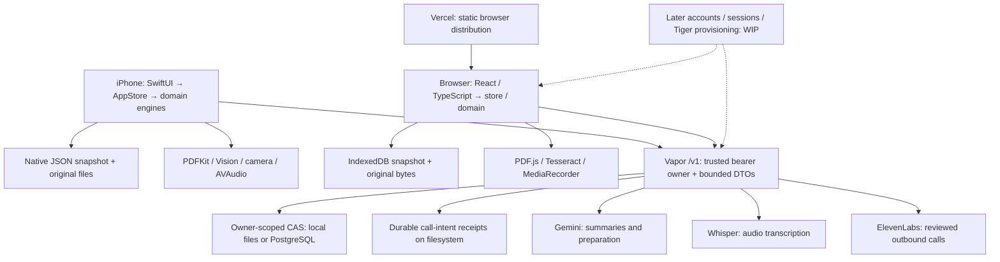

# Reva codebase audit — completed with Codex continuation

**23 confirmed defects: 14 P2 and 9 P3.** The most consequential findings concern stale provider results, missing or altered source excerpts, and editors replacing newer data. No P0 or P1 finding survived validation. This audit completed the review and repair plan; it did not apply application fixes or certify unexecuted features.

Start with the [ranked repair backlog](repair-backlog.csv), then the [67-item coverage sheet](reports/coverage.csv). The [canonical findings](findings.json) contain exact frozen file/line, trigger, impact, smallest fix, regression check and validator rationale. The [complete register](finding-register.json) preserves all original assertions and their final dispositions.

## Scope and authorship

The audited source is commit `cfe09971443989396b8ef6a14cdf935adba86ddd` plus its captured tracked patch and four first-party WIP files, frozen at 11:43:22 Chicago time on September 12, 2026. The [snapshot manifest](snapshot-manifest.json) records all 267 source hashes and the exact worktree. Those hashes still match after the audit. Every source line in the findings refers to this frozen target.

Fable 5.1 Ultracode completed tracks 01–06, the stage-one test runner, partial track-11 findings and a browser capture matrix before exhausting its session limit. On the user's instruction, Codex completed tracks 07–16, additional production-state reproductions, two independent validator passes, coverage and synthesis. Codex work is identified as such. Fable's original outputs are preserved with [handoff hashes](evidence/codex-takeover/fable-handoff-manifest.json); its monitor is paused.

The live checkout contains newer unfinished account/Tiger work. The earlier spec/handoff documentation was reconciled in `ec04875`, but that is a documentation checkpoint, not an application completion checkpoint. This audit does not assert that later account code is absent, broken or tested. It needs a separate review after its owner completes a coherent checkpoint.

## Fix these first

| Priority | Finding | Practical consequence and evidence |
| --- | --- | --- |
| P2 | **RVA-10-001 — native late provider results** | A summary started under connection A can publish after switching to B. A call poll can save A's transcript into a replacement B snapshot with a matching request ID. Reproduced with unchanged production AppStore methods and a controlled transport double; this is stale client publication, not a demonstrated server authentication bypass. |
| P2 | **RVA-02-002 / 02-005 — source excerpt integrity** | The character cap can turn synthetic `dose: 100 mg` into an unmarked `dose: 10` excerpt. A fixture heuristic can also remove ordinary content preceding `Source date:`. Both reproduced in the production Swift ReportEngine; browser counterparts are source-reviewed. Preserve exact source spans and disclose omissions outside quoted text. |
| P2 | **RVA-05-004 / 07-001 — mixed PDF OCR** | Native and browser extraction may accept a short embedded header and skip the scanned body. Both are confirmed from their complete extraction branches. They need mixed-page regression fixtures; no runtime OCR reproduction or claim of perfect extraction is made. |
| P2 | **RVA-05-001 / 04-005 / 08-001 — stale editors** | Native recording notes can replace a newer transcript; a native record editor can erase a newly saved AI summary; browser brief notes can clear questions generated while the editor is open. Source-confirmed state/merge defects. Use current values plus field-specific edits and stable conflict baselines. The separate native visit-editor candidate remains unverified. |
| P2 | **RVA-03-001 — startup repair failure** | A failed repair write sets `startupError` even when valid state was loaded, sending the app to recovery instead of exposing that state. The state condition is reproduced; the recovery UI branch is source-reviewed. |
| P2 | **RVA-05-008 / 05-002 — recording failure recovery** | A finished audio file has no retry-save path after metadata persistence fails. A failed finalization also leaves inconsistent pause/resume guidance. Confirmed from the state transitions; physical device interruption/codec behavior is unverified. |
| P2 | **RVA-04-001 — native appointment order** | Raw ISO string ordering chooses the wrong next visit across offsets. Production AppStore places 08:45Z before 10:00+02:00, although the latter is 08:00Z. Sort actual instants. |
| P2 | **RVA-16-001 — deployment instructions** | One README specifies both repository-root and `apps/web` Vercel roots, which select different build/routing/security configurations. This is a confirmed configuration-guidance conflict. It does **not** prove the cause of the reported hosted 404; hosted Vercel was not tested. |
| P2 | **RVA-14-001 — tablet navigation names** | Responsive CSS hides the only labels on still-focusable navigation controls, leaving no accessible replacement name. Source-confirmed; the screenshot collector's empty “unlabeled” list does not test this correctly. |

The nine P3 repairs cover overly broad fixture relevance, local-date labeling, a busy-state no-op, camera Scan categorization, small-text/selection contrast, stale teal PDF headings, unused attachment keys after failed browser imports, and clean standalone check prerequisites. All are individually described in the backlog. These should not displace the data-preservation work above.

## What the evidence establishes

| Area | Observed result |
| --- | --- |
| Native and server packages | Root Swift package: 43 passed, one gated test skipped. Server package: 31 passed, one PostgreSQL gate skipped. Generic iOS Simulator build succeeded. Compilation is not an interactive simulator or hardware test. |
| Browser build and tests | Clean install completed. Standalone typecheck and five test files initially failed because generated demo assets were absent. Production build ran its asset preparation successfully; subsequent typecheck and all 77 browser tests passed. This clean-check prerequisite is RVA-16-002. |
| Wrapper and local integration | Seven Node wrapper tests passed. Optimization checks, the native-client/local-server integration, local server restart/owner/CAS/attachment smoke and unconfigured-provider failure behavior passed. PostgreSQL-unavailable startup failed closed as intended. |
| Cross-platform report contract | A fresh execution of the frozen Swift ReportEngine produced all three signature goldens expected by the browser tests. The earlier missing-evidence finding is closed. |
| Browser layout | Fable saved 76 PNG/DOM/measurement sets covering 12 route/form states at 375, 390, 768, 1024, 1440 and 1920 pixels, plus four tall captures. No horizontal document overflow was reported. This is layout evidence, not proof of completed workflows, keyboard access or screen-reader behavior. |
| Code organization | The structure check passed across 71 Swift and 53 browser files; 86 explicitly enumerated Swift files passed lint. Responsibility headers and separate domain/state/storage/device/provider layers are substantive. Three-person ownership is practical with deliberate ownership of shared stores, contracts and generators. No NASA certification is claimed. |
| Source preservation | All 267 frozen source hashes remain unchanged. Audit commits contain reports and synthetic evidence only. |

See the [original runner report](reports/17-evidence-runner.md) for exact commands and captured results and the [Codex evidence adjudication](reports/17b-codex-evidence-adjudication.md) for reproductions and limits. Raw Fable `.log` files remain in the local audit directory and are [indexed by hash](evidence/codex-takeover/evidence-inventory.json); report summaries, JSON measurements and synthetic screenshots are versioned.

## Stack and review boundaries

The browser is a separate implementation sharing contracts and fixtures with native Swift. Static hosting does not deploy the Vapor API or its authenticated routes. Call-intent receipts require their documented persistent filesystem even when snapshots use PostgreSQL. Local MyChart connection and custom password-based document encryption remain outside the authorized MVP, as the spec states.

The storage and provider review found meaningful protections already present: owner isolation, revision checks, bounded input, trusted route identity, original-file preservation, source links/version freshness, configured-service gates, and durable call intent with separate human confirmation. Suggested simplifications target duplicated rules or contract ownership rather than file length or arbitrary fragmentation.

## Coverage and unresolved verification

All **67 checklist items have a final disposition**: **18 Pass, 22 Defect, 22 Unverified, 5 WIP**. A checked box means the review reached a disposition; it does not mean the feature passed. One requirement can reference several defects, and one defect can affect several requirements, so these counts differ from the 23-item repair queue.

The 77 incoming assertions became **74 canonical records**: 23 confirmed, 36 suggestions, six evidence gaps, three WIP observations, three unresolved candidates and three rejected/closed items. Three duplicated confirmed entries were merged. Examples of challenged claims: the alleged audio error remapping was rejected, completed regression/signature gaps were closed, and documented original retention was kept as a capacity-policy improvement rather than relabeled corruption.

The remaining execution gates are explicit:

- Successful PostgreSQL/Tiger migrations, TLS, concurrency and persistence against a real dedicated database. The failure gate and SQL source review do not prove successful operation.
- Real provider credentials/entitlements, Gemini clinical and adversarial semantic fidelity, live transcription, and an actual reviewed phone call. Current model/API catalog names were checked against official documentation; live access was not exercised.
- The later account/session implementation, demo/account separation and completed deployment contract. These belong to the next completed application snapshot.
- Physical iPhone behavior, Safari/Firefox, audio permissions/interruption/codecs, interactive native navigation, keyboard/screen-reader/zoom checks, and a current exported print/PDF artifact.
- Full end-to-end import → review → save → prepare → source → edit → stale → regenerate → export → reload journeys, plus complete recording and booking journeys.
- Representative large-file memory/latency measurements. The 50.7 MB raw distribution includes 47.8 MB of OCR assets; it is not initial page download size. CPU-contended build timings are not performance benchmarks.

## Three-person repair handoff

| Owner | Worktree scope | Coordination |
| --- | --- | --- |
| A — Native and domain | Provider-generation guards, source excerpts, AppStore recovery/order, native editors and recording lifecycle. | Own shared AppStore and ReportEngine integration. Land focused commits and preserve source/version protections. Coordinate equivalent browser domain fixes with B. |
| B — Browser and accessibility | Browser mixed-PDF extraction, failed-import keys, brief-note conflict baseline, tablet names and selection contrast. | Own browser feature files/styles. Use shared fixture expectations for source fidelity; avoid concurrent edits to the central store with account work. |
| C — Server and release integration | Reconcile Vercel root/config and clean-check scripts; execute deployment/database/provider gates after configuration is concrete. | Own contracts, build/deploy scripts and migration review. Keep later account WIP separate until its completed checkpoint is ready. |

Each row of [repair-backlog.csv](repair-backlog.csv) includes its owner, trigger, precise source location, smallest repair, regression check and coordination constraint. The [36 optional improvements](improvements.csv) are separate from confirmed defects. Rebase review worktrees onto a coherent implementation checkpoint before applying fixes; the frozen audit worktree should remain unchanged for reproducibility.

The [audit log](AUDIT-LOG.md) records execution and checkpoints. `finalize-audit.py` deterministically rebuilds the findings, queues and coverage from the preserved reviews and independent dispositions.
