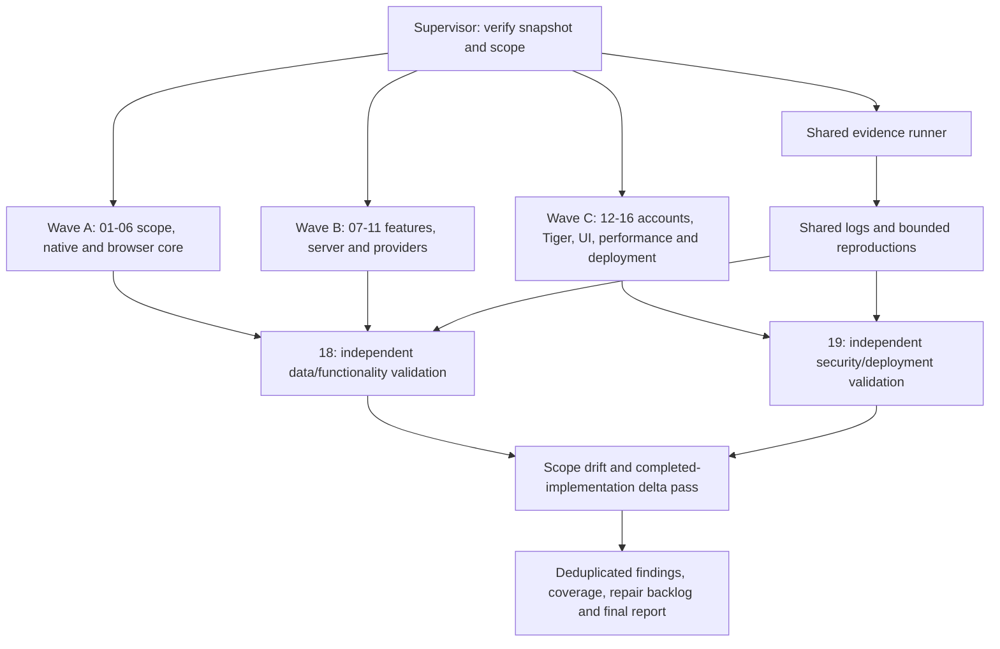

# Reva intensive Fable audit workflow

User request: launch a separate Claude Desktop chat, use Fable 5.1 with Ultracode effort, and coordinate a major multi-agent review of the whole Reva codebase against its specification. Produce feedback on code quality, functionality, cleanliness, efficiency, data integrity, security, accessibility and deployment. This is an audit and recommendations workflow, not an instruction to implement fixes or publish deployments.

## Exact locations and starting state

- Main project: `/Users/tempadmin/Documents/Reva`.
- Frozen review worktree: `/Users/tempadmin/Documents/Reva/.worktrees/fable-audit-20260912-114322`.
- Base commit: `cfe09971443989396b8ef6a14cdf935adba86ddd`.
- Audit packet and sole report output directory: `/Users/tempadmin/Documents/Reva/docs/audits/fable-20260912-114322`.
- `snapshot-manifest.json` records 267 captured-file hashes and the committed base plus in-progress tracked/untracked source changes. `.audit-source-delta.patch` in the worktree preserves the raw captured diff. No real .env, dependency directory, patient storage or credentials were copied.
- Another Claude session, **Reva architecture review**, is actively implementing landing/demo/login/signup/password/Tiger changes in the main checkout. Do not interrupt it or write into its application files. The frozen snapshot intentionally includes some WIP; do not declare unfinished work a completed-feature regression. Missing future code must be WIP/Unverified, not excused by obsolete auth deferral.

## Required organization: 20 roles

Act as supervisor and use your real workflow/multi-agent capability. Create **16 independent source-review tasks**, one for each `tasks/01.md` through `tasks/16.md`, plus **one shared evidence runner** (`tasks/17-evidence-runner.md`) and **two independent validators** (`tasks/18-validator.md`, `tasks/19-validator.md`). With you, this is 20 roles. Give each worker its full task packet, the checklist, exact snapshot/output paths, and shared finding schema. Use Fable 5.1 and Ultracode where the platform supports that setting; record actual model/effort and any platform limit. Do not silently substitute another model or claim agents exist when they do not.

Dispatch a real large batch of review work, in dependency-based waves with up to six source reviewers concurrently or the platform's available limit. The account's existing limits apply; do not purchase credits or change account plans. If a limit is reached, save completed work and report it. No unbounded recursive spawning: workers may request narrow evidence, but only you create/replace workflow tasks. Reuse actual running task IDs, never duplicate a still-running reviewer.

### Execution graph

Start review and baseline checks on the supplied immutable snapshot now. At integration, read only Git status/log/diffs in the main project to see whether a new implementation checkpoint appeared. Do not assume file quietness means completed implementation. If a completed checkpoint or explicit completion marker is available, create a second isolated snapshot and dispatch only affected reviewers/validators for that delta, retaining the first snapshot evidence. If the other session is still working, finish the captured-snapshot review and prominently list account/Tiger/new-route items as WIP requiring follow-up; do not wait forever or mix live files into existing evidence. You may ask the user to run a delta review after the implementation completes, but never label WIP as validated.

## Checklist authority

Read `checklist.md` (67 requirement checks) and the source docs named by track01. Latest explicit user intent wins over historical plans. Active capabilities include SwiftUI iPhone, responsive React browser, manual uploads/OCR/originals, per-document memory, source-grounded visit prep, Medical profile, symptom entries, recording/transcripts/memory, booking simulation/configured calls, explicit sync and Tiger adapter. Heart palette is current; earlier six-color swatches are provenance. New landing/account/password/Tiger integration is WIP from the separate implementation session and must be examined if present.

Do not turn old proposed Cloud Storage/Tasks/Identity Platform/Document AI/SwiftData/50MB schema architecture into mandatory implementation. MyChart import, custom password-derived document encryption, automatic clinic confirmation, live cellular capture and production certification remain excluded unless genuinely added by newer code/spec. Ordinary secure password hashing for newly implemented accounts is distinct from deferred custom document encryption.

## Review and resource rules

- Audit source read-only; no app/config fixes, dependency upgrades, database migration of live data, commits/pushes, or deployments. Report-only writes stay under the audit output directory. Temporary build/test files belong only in the isolated snapshot or a dedicated temporary directory.
- Use synthetic data and sanitized child environments. Do not read .env, credentials, private keys, real patient storage or unreviewed user files. No live Gemini/Whisper/ElevenLabs/Twilio/Tiger calls, even if keys happen to exist. No external messages.
- Only track17 runs builds or owns UI/ports. Inspect launcher safety before execution. Do not reuse the implementation session's servers, simulator session or browser data. Missing permissions become evidence gaps; never bypass a protection.
- Every claim requires precise snapshot, file/line, trigger, actual consequence and evidence. Distinguish source-proven issue, reproduced failure, missing evidence, WIP and optional improvement. No finding quota, fabricated measurements, generic best-practice dump or blanket claim that all code was checked.
- Review credentials/configuration mechanisms and placeholder examples without reading or printing actual secret values. If a source unexpectedly contains a credential-like value, record only location/type and redact the value.
- Large files are prioritization hints, not automatic defects. Efficiency findings need bounded measurement or a concrete asymptotic/resource argument. Comments should describe responsibilities, not merely restate lines.

## Required output and completion criteria

Create `workflow-status.json` immediately with actual supervisor/workflow/worker IDs, observed model/effort, current phase, assigned task files and source snapshot. Keep it current at meaningful phase boundaries. Produce `reports/track-01.md` through `track-16.md` and findings JSON, runner report/logs, independent validation reports, and complete `reports/coverage.csv` with evidence/status for all 67 IDs.

The final deliverables are:

1. `FINAL-REPORT.md`: brief executive assessment, exact audited snapshots, working functionality, ranked confirmed issues, WIP/unverified/deferred boundaries, code quality/cleanliness/performance conclusions, test/build/UI evidence and limitations.
2. `repair-backlog.csv`: severity, finding ID, title, affected files, concrete fix direction, regression acceptance, recommended three-person owner, dependency and estimated scope (small/medium/large, not invented hours).
3. `findings.json`: deduplicated confirmed/rejected/candidate issues with validator disposition using `finding-schema.json`.
4. Updated `reports/coverage.csv` and `workflow-status.json`, linking all evidence and explicit skips.

A reviewer finishing early can help validators only through an explicit focused reassignment. Finish when all available work is adjudicated and every requirement has a truthful disposition. Do not claim completion merely because a large batch was launched. Notify the user with early material issues and final artifact paths in this separate Claude chat. Begin by verifying paths/model and launching the actual worker workflow, not by returning only a plan.
