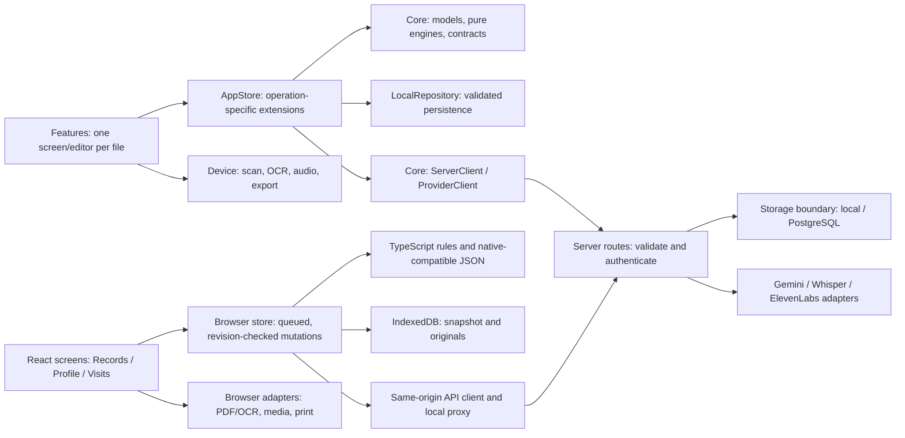

# Reva code organization and writing standard

Reva uses focused files and named responsibility blocks. Production Swift and browser source files start with their purpose, inputs, outputs and side effects. Within the file, `// MARK: - …` identifies each logical section; CSS uses the corresponding block-comment form. Comments explain the section's job or a constraint that must survive edits. Read the file contract first, then the section relevant to the change.

This is a project-specific, NASA-inspired standard. NASA's handbook emphasizes readable, maintainable code and standards tailored to the language and project; the original JPL *Power of Ten* emphasizes simple control flow, bounded work, small routines and checked boundaries. Reva adopts those principles where they fit Swift and browser application code. It is not a flight-software implementation or a claim of NASA certification. [NASA coding-standards guidance](https://swehb.nasa.gov/spaces/SWEHBVC/pages/84279577/9.03+Coding+Standards), [original Power of Ten paper](https://spinroot.com/gerard/pdf/P10.pdf).

## Dependency direction



These are source ownership boundaries across two interfaces and one Swift server. The browser renders React rather than compiling SwiftUI; JSON identities, source versions, and API behavior are the shared contract. Each screen can be edited independently. Closely coupled private helpers remain beside their owner: native PDF/Quick Look bridges stay with `SourcePreview`, and audio recording/playback share their private session coordinator. Browser extraction and microphone lifecycle helpers stay beside their feature. The [team workflow](team-workflow.md) assigns one writer per shared boundary.

| Block | Primary files | Responsibility |
| --- | --- | --- |
| Screens and editors | `Features/Records`, `Preparation`, `Profile`, `Visits` | Render state, collect input, delegate actions. |
| Shared presentation | `Features/Shared` | Root navigation, palette, reusable components and rows. |
| App state | `State/AppStore.swift` and `AppStore+*.swift` | Own observable state; publish mutations after successful persistence. |
| Provider operations | `AppStore+AI`, `+Transcription`, `+LiveCalls`, `+Providers` | Keep each operation's validation, concurrency checks and effects together. |
| Domain and wire values | `Core/Models`, `SymptomEntry`, `ProviderContracts` | Define persisted/source identities and transport values. |
| Pure rules | `Core/ReportEngine` | Source selection, citations and transcript-backed summary rules. |
| IO boundaries | `LocalRepository`, `ServerClient`, `ProviderClient`, `Device/*` | Files, HTTP, permissions and platform resources. |
| Server | `server/Sources/RevaServer` | Route contracts, authenticated owner storage, deadlines and separate provider adapters. |
| Browser screens | `apps/web/src/features/records`, `profile`, `visits` | Render shared state and collect input; delegate durable edits and connected requests. |
| Browser shell/presentation | `apps/web/src/App.tsx`, `components`, `styles` | Navigation, reusable controls, responsive layout, and approved palette tokens. |
| Browser state and contracts | `apps/web/src/core/store.ts`, `models.ts`, `mutations.ts`, `validation.ts`, `domain.ts`, `symptoms.ts` | Serialize changes, preserve versions/evidence, validate native-compatible snapshots, and keep pure rules testable. |
| Browser IO | `core/repository.ts`, `core/api.ts`, Records extraction, Visits recorder | IndexedDB, same-origin HTTP, bounded local PDF/OCR, and owned microphone resources. |
| Browser runtime setup | `apps/web/scripts`, `vite.config.ts` | Generate fictional/OCR assets and serve/proxy only the configured local API paths. |

## Block comments

Use this form, replacing the example with the actual contract:

```swift
// Purpose: Save an edited source without losing a newer revision.
// Inputs: The edited record and its original source version.
// Outputs: A persisted record or a conflict/validation error.
// Side effects: Writes the local snapshot; no HTTP requests.

// MARK: - Validate source identity
// Reject stale edits before changing the stored value.
```

Use section names such as “Input validation”, “Snapshot save”, “Manual outcome refresh” or “Rendering and navigation”. A chunk is a cohesive type, operation, or group of small helpers serving one purpose. Do not add a banner above every statement or comments that merely translate syntax. Place constraints immediately before the code they govern. Update comments whenever behavior changes; a stale contract is a defect.

The header form also applies to TypeScript, TSX, and JavaScript modules; CSS uses `/* Purpose: … */` and `/* MARK: - … */`. Test files explain the scenario boundary and fixture side effects. Python tools start with a module contract, preserving shebangs and future imports; major stages have comments or function docstrings. SQL uses `--` contracts and sections. Generated Xcode project files, generated browser assets/build output, fixture data, lockfiles, and vendored dependencies are excluded from manual chunk annotation.

## Writing and review rules

1. **Keep responsibility narrow.** Prefer one screen/editor or service responsibility per file. Extract a helper when a routine mixes independent operations or becomes difficult to review. Keep related domain values and private lifecycle helpers together when separating them would weaken ownership.
2. **Use direct control flow.** Prefer guards and explicit states over deeply nested branches. Use descriptive names, the smallest useful visibility, immutable values where possible and one statement per line.
3. **Check boundaries.** Validate untrusted input, decoded provider output, source IDs, timestamps and revisions before publishing state. Surface recoverable errors explicitly. Document deliberately ignored failures and preserve original user data.
4. **Bound work and own cancellation.** Apply existing byte/page/text limits and HTTP/database deadlines. Lifecycle tasks must have a named owner and explicit stop/cancel conditions. Swift concurrency deadlines remain cooperative: underlying work must honor cancellation.
5. **Make effects visible.** Keep file/network/permission effects at their documented boundary. Native AppStore and the browser store each own their local snapshot. Awaiting a provider result requires rechecking captured source state before applying it. Browser effects clean up subscriptions, workers, object URLs, and microphone tracks; stale asynchronous completions cannot overwrite a newer attempt. Recording retries must retain original audio and stable identity.
6. **Keep comments useful.** Explain the purpose, invariant, failure handling or reason for a limit. Public/shared boundary changes require a contract update and caller review. Do not describe generated transcripts or OCR as already reviewed.
7. **Verify the affected behavior.** Run the formatter and structure check, relevant tests, a native build for moved SwiftUI files, and browser typechecking/build for browser changes. Tests should exercise meaningful outcomes and failures: persistence conflicts, source accuracy, cancellation, identity changes, and malformed responses. Preserve review evidence and commit checkpoints.

SwiftUI declarative layouts can be longer than a small imperative routine. Avoid arbitrary fragmentation that obscures state ownership or changes view identity. We do not impose the original C-oriented restrictions on dynamic allocation or every loop: Swift/Apple frameworks and event lifecycles use those facilities. Large logical sections still need a clear name, purpose and reviewable boundaries.

The same principle applies to JSX: split screens, editors, pure rules, and lifecycle hooks by responsibility rather than arbitrary line counts. Render user/provider strings as text; never use unsanitized HTML. Keep provider keys exclusively on the server, the browser workspace bearer token in memory, and sync actions explicit. Preserve original text/page evidence when applying AI output. The current [heart palette](../design/palette.json) is centralized in native Theme and browser `styles/tokens.css`; feature files should use roles instead of inventing colors.

## Mechanical checks

`.swift-format` uses four-space indentation, a 110-column layout target, expanded semicolon-separated statements, separate enum cases/variable declarations and ordered imports. Multiline string literal content is preserved. Most optional rewriting rules are disabled to keep the formatter focused on presentation.

From the repository root:

```sh
swift-format format --in-place --recursive --configuration .swift-format \
  apps/ios/Reva server/Sources Tests server/Tests Package.swift server/Package.swift
swift-format lint --strict --recursive --configuration .swift-format \
  apps/ios/Reva server/Sources Tests server/Tests Package.swift server/Package.swift
python3 scripts/check_code_structure.py
```

Use the `swift-format` shipped with the selected Xcode toolchain. The structure check verifies leading contracts and a named section in first-party native/server Swift, plus browser TS/TSX/JavaScript/CSS files under `src` and `scripts`. It cannot judge comment accuracy, function cohesion or runtime safety; those remain review responsibilities. A long literal or source quotation may exceed the layout target without being rewritten.

Browser formatting uses the checked-in Prettier configuration. From the repository root:

```sh
npm --prefix apps/web run format
npm --prefix apps/web run format:check
npm --prefix apps/web run typecheck
npm --prefix apps/web test
npm --prefix apps/web run build
```

Run formatting only for owned files during parallel work; the captain runs the integrated formatting command after merging. Browser tests use synthetic fixtures, IndexedDB fakes, and injected transport/media responses. Passing these checks does not establish real microphone/codec compatibility, provider credentials, live database readiness, or deployed hosting. See the [browser guide](../apps/web/README.md) for local setup and implemented limits.

After adding or moving native files, regenerate the project with `python3 scripts/generate_project.py`. The integration captain owns that generated diff. Read [architecture.md](architecture.md) for runtime flows and [team-workflow.md](team-workflow.md) for worktrees and integration checks.
