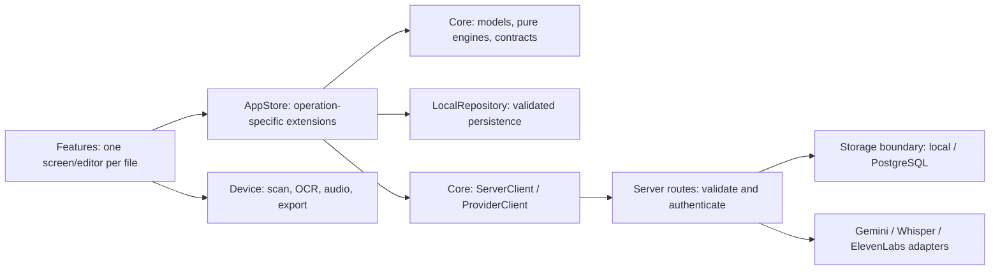

# Reva code organization and writing standard

Reva uses focused files and named responsibility blocks. Every production Swift file starts with its purpose, inputs, outputs and side effects. Within the file, `// MARK: - …` identifies each logical section; comments explain the section's job or a constraint that must survive edits. Read the file contract first, then the section relevant to the change.

This is a project-specific, NASA-inspired standard. NASA's handbook emphasizes readable, maintainable code and standards tailored to the language and project; the original JPL *Power of Ten* emphasizes simple control flow, bounded work, small routines and checked boundaries. Reva adopts those principles where they fit Swift. It is not a flight-software implementation or a claim of NASA certification. [NASA coding-standards guidance](https://swehb.nasa.gov/spaces/SWEHBVC/pages/84279577/9.03+Coding+Standards), [original Power of Ten paper](https://spinroot.com/gerard/pdf/P10.pdf).

## Dependency direction



These are source ownership boundaries within the existing native target and server package. Each screen can be edited independently. Closely coupled private helpers remain beside their owner: PDF/Quick Look bridges stay with `SourcePreview`, and audio recording/playback share their private session coordinator. The [team workflow](team-workflow.md) assigns one writer per shared boundary.

| Block | Primary files | Responsibility |
| --- | --- | --- |
| Screens and editors | `Features/Records`, `Preparation`, `Profile`, `Visits` | Render state, collect input, delegate actions. |
| Shared presentation | `Features/Shared` | Root navigation, palette, reusable components and rows. |
| App state | `State/AppStore.swift` and `AppStore+*.swift` | Own observable state; publish mutations after successful persistence. |
| Provider operations | `AppStore+AI`, `+Transcription`, `+LiveCalls`, `+Providers` | Keep each operation's validation, concurrency checks and effects together. |
| Domain and wire values | `Core/Models`, `SymptomEntry`, `ProviderContracts` | Define persisted/source identities and transport values. |
| Pure rules | `Core/ReportEngine`, `BookingEngine` | Source selection/citations and simulated booking rules. |
| IO boundaries | `LocalRepository`, `ServerClient`, `ProviderClient`, `Device/*` | Files, HTTP, permissions and platform resources. |
| Server | `server/Sources/RevaServer` | Route contracts, authenticated owner storage, deadlines and separate provider adapters. |

## Block comments

Use this form, replacing the example with the actual contract:

```swift
// Purpose: Save an edited source without losing a newer revision.
// Inputs: The edited record and its original source version.
// Outputs: A persisted record or a conflict/validation error.
// Side effects: Writes the local snapshot; no HTTP requests.

// MARK: - Validate source identity
// Reject stale edits before changing the stored value.
```

Use section names such as “Input validation”, “Snapshot save”, “Manual outcome refresh” or “Rendering and navigation”. A chunk is a cohesive type, operation, or group of small helpers serving one purpose. Do not add a banner above every statement or comments that merely translate syntax. Place constraints immediately before the code they govern. Update comments whenever behavior changes; a stale contract is a defect.

Test files explain the scenario boundary and fixture side effects. Python tools start with a module contract, preserving shebangs and future imports; major stages have comments or function docstrings. SQL uses `--` contracts and sections. Generated Xcode project files, fixture data and vendored dependencies are excluded from manual chunk annotation.

## Writing and review rules

1. **Keep responsibility narrow.** Prefer one screen/editor or service responsibility per file. Extract a helper when a routine mixes independent operations or becomes difficult to review. Keep related domain values and private lifecycle helpers together when separating them would weaken ownership.
2. **Use direct control flow.** Prefer guards and explicit states over deeply nested branches. Use descriptive names, the smallest useful visibility, immutable values where possible and one statement per line.
3. **Check boundaries.** Validate untrusted input, decoded provider output, source IDs, timestamps and revisions before publishing state. Surface recoverable errors explicitly. Document deliberately ignored failures and preserve original user data.
4. **Bound work and own cancellation.** Apply existing byte/page/text limits and HTTP/database deadlines. Lifecycle tasks must have a named owner and explicit stop/cancel conditions. Swift concurrency deadlines remain cooperative: underlying work must honor cancellation.
5. **Make effects visible.** Keep file/network/permission effects at their documented boundary. AppStore is the app's snapshot owner. Awaiting a provider result requires rechecking the captured source state before applying it. Real-call retries must retain durable request identity.
6. **Keep comments useful.** Explain the purpose, invariant, failure handling or reason for a limit. Public/shared boundary changes require a contract update and caller review. Do not describe generated transcripts or OCR as already reviewed.
7. **Verify the affected behavior.** Run the formatter and structure check, relevant tests, and a native build for moved SwiftUI files. Tests should exercise meaningful outcomes and failures. Preserve review evidence and commit checkpoints.

SwiftUI declarative layouts can be longer than a small imperative routine. Avoid arbitrary fragmentation that obscures state ownership or changes view identity. We do not impose the original C-oriented restrictions on dynamic allocation or every loop: Swift/Apple frameworks and event lifecycles use those facilities. Large logical sections still need a clear name, purpose and reviewable boundaries.

## Mechanical checks

`.swift-format` uses four-space indentation, a 110-column layout target, expanded semicolon-separated statements, separate enum cases/variable declarations and ordered imports. Multiline string literal content is preserved. Most optional rewriting rules are disabled to keep the formatter focused on presentation.

From the repository root:

```sh
swift-format format --in-place --recursive --configuration .swift-format \
  apps/ios/Reva server/Sources Tests server/Tests Package.swift server/Package.swift
swift-format lint --strict --recursive --configuration .swift-format \
  apps/ios/Reva server/Sources Tests server/Tests Package.swift server/Package.swift
python3 scripts/check_code_structure.py
```

Use the `swift-format` shipped with the selected Xcode toolchain. The structure check verifies leading contracts and a named section in every first-party native/server Swift source file. It cannot judge comment accuracy, function cohesion or runtime safety; those remain review responsibilities. A long literal or source quotation may exceed the layout target without being rewritten.

After adding or moving native files, regenerate the project with `python3 scripts/generate_project.py`. The integration captain owns that generated diff. Read [architecture.md](architecture.md) for runtime flows and [team-workflow.md](team-workflow.md) for worktrees and integration checks.
