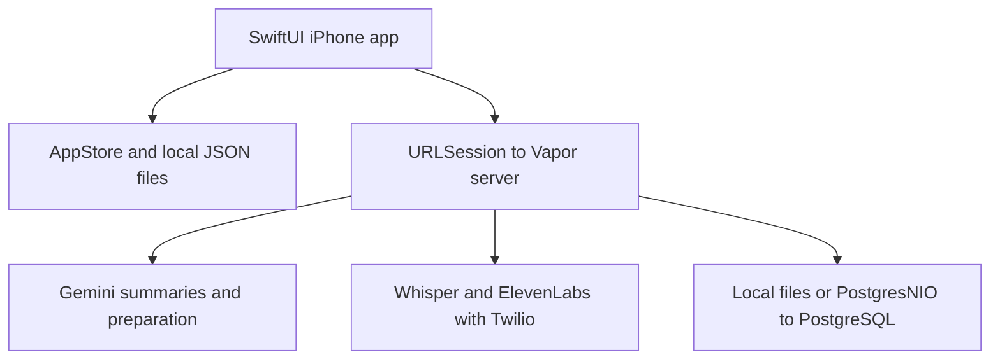
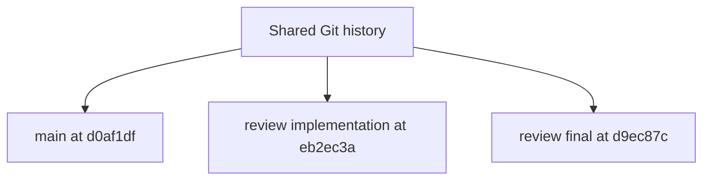
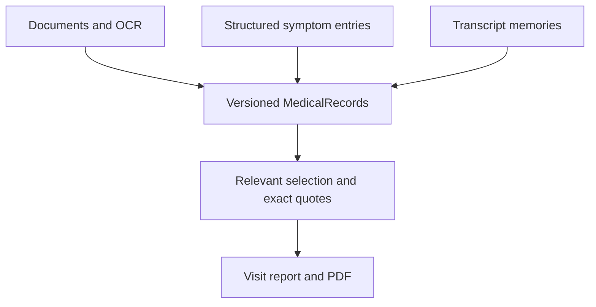

# Reva project overview packet

Team handoff | September 12 2026 | Code baseline d0af1df

Reva is a native iPhone MVP that brings records, symptom observations and visit memories together to prepare a useful conversation with a clinician. This packet explains the current code, the local worktrees, team ownership, and how data moves through the app and optional services.

**The local demo is working.** Provider adapters are implemented and tested with mocks; credentials, live provider checks and the optional Tiger database still require setup. No production web app or MyChart connection is included.



Sky nodes describe implemented app/server components. Gold nodes identify configurable service or storage boundaries; live activation is separate from implementation.

### How to use this packet

| Pages | What you will find |
| --- | --- |
| 2-3 | Existing worktrees, branch safety and three-person ownership |
| 4-5 | Data relationships, workflow behavior and feature status |
| 6-7 | Connectors, configuration, running the project and evidence |

The phone saves locally first. Server sync is an explicit transfer; AI and call requests are separate operations. Provider secrets belong on the server. The app never talks directly to PostgreSQL.

Repository: https://github.com/Siddiqui-R/2026_ricehackathon_medicine
Product domain: revamed.health. This packet does not claim a deployed site.


---

## Existing worktrees

Inventory inspected at d0af1df before this documentation update

A Git worktree is a separate folder with its own branch, checked-out files and uncommitted changes, sharing one repository's commit history. Worktrees support parallel editing on one machine. They are not separate services, environments deployed to users, or copies that sync automatically.



| Checkout and branch | Observed state | Relationship |
| --- | --- | --- |
| Reva<br>main | Clean integration checkout at d0af1df; matches the local origin/main tracking ref. | Current baseline |
| .worktrees/implementation-review<br>review/implementation | eb2ec3a; 2 modified tracked files and 2 untracked review reports. Nothing staged. | 6 commits behind baseline main |
| .worktrees/final-review<br>review/final | d9ec87c; 1 untracked API review report. No tracked modifications or staged changes. | 4 commits behind baseline main |

All paths above are relative to /Users/tempadmin/Documents/Reva except the root label Reva. This documentation commit will advance main beyond the inventory baseline.

### What the review folders contain

The implementation-review patch changes the older AppStore.swift and UI/RecordsView.swift layout: source versions, metadata-edit preservation, summary labels and PDF page navigation. Its pending diff is 55 insertions and 14 deletions. Reports are 02-implementation.md and 03-targeted-revision.md. The final-review folder holds mvp-api-contract-review.md.

**Preserve these folders as review evidence.** Neither review branch has commits absent from main. Their uncommitted content targets older code, while main already contains integrated fixes and later features. Compare any useful idea against current code; do not merge or copy either folder wholesale.


---

## Working as a three person team

Separation is by folders and focused AppStore extensions inside one iPhone target. The suggested feature branches below do not exist yet. Create them from the same agreed main checkpoint when the team is ready. One teammate also acts as integration captain; that is a coordination role, not a fourth developer.

| Owner | Primary files | Suggested branch |
| --- | --- | --- |
| 1  Records and preparation | Features/Records and Features/Preparation; AppStore +Records, +Symptoms, +Visits; document import, scan and PDF adapters. | mvp/records-preparation |
| 2  Booking and visit memory | Features/Visits; AppStore +Bookings and +Recordings; Device/AudioServices.swift. | mvp/visit-memory |
| 3  Server and providers | server/**: HTTP routes, Gemini/voice adapters, local/Postgres stores, migrations, server tests and setup. | mvp/server-providers |
| Integration captain | Core shared models/DTOs, shared UI/theme, Medical profile, root navigation, provider/sync state, scripts, project file and contracts. | Integrates into main |

App paths begin at apps/ios/Reva/. Core/SymptomEntry.swift is owned with records; shared Models.swift and ReportEngine.swift changes still need coordination.

### Proposed worktree setup

From a clean integration checkout, agree a base SHA and branch names first. The following creates sibling feature folders; it does not alter the retained review worktrees.

```sh
git fetch origin
git status --short
git pull --ff-only origin main
reva_base=$(git rev-parse HEAD)
git worktree add -b mvp/records-preparation \
  ../Reva-records-preparation "$reva_base"
git worktree add -b mvp/visit-memory \
  ../Reva-visit-memory "$reva_base"
git worktree add -b mvp/server-providers \
  ../Reva-server-providers "$reva_base"
```

### How changes come back together

Each person edits only their assigned checkout, makes small commits and sends the captain the SHA, changed files, tests and any contract change. The captain reviews and merges one branch at a time, resolves shared edits deliberately, regenerates the Xcode project when needed, checks the integrated build and pushes main.

On separate computers, use separate clones and exchange pushed commits. Keep one owner for simulator verification on a shared Mac: two checkouts using the same app bundle can overwrite the same demo state. Worktrees reduce file conflicts; they do not coordinate shared DTOs, build outputs or runtime data for you.


---

## Data and component interactions



### From a source to a visit brief

Files and photos enter through native pickers. PDFKit reads embedded PDF text; Vision performs OCR and VisionKit supplies camera scanning on supported iPhones. The user reviews the extracted wording and date. Reva preserves the original file, saves a record, and produces a local excerpt. If connected AI is enabled, it can replace that summary with a labeled Gemini result.

Preparation uses visit type, concern, goal and pinned records. Locally, ReportEngine matches terms and context against titles, tags, summaries and full text. Connected preparation submits readable record candidates to Gemini for an overview, questions and source IDs. The client validates IDs, retains pins and creates exact source excerpts locally. This is currently a record scan, not a vector database or embeddings pipeline.

| Object | Purpose and connection |
| --- | --- |
| PatientProfile | Persistent identity, allergies, medications, conditions, procedures and care notes. Quick-reference information; currently excluded from the records-only preparation input. Profile name is used in configured call requests. |
| MedicalRecord + SymptomEntry | Searchable source text, summary, original file reference, status and version. Optional structured symptom fields retain occurrence time/zone and the user's observations. |
| Visit + VisitReport | Appointment goal, notes, questions and pins; generated sections reference source record IDs, versions and original pages where known. |
| VisitRecording + BookingRequest | Transcript segments/audio and saved-memory backlinks; separate booking state, stable call request identity and provider outcome. |

AppStore writes a complete AppSnapshot through LocalRepository using an atomic JSON replacement and one backup. Original files are separate. Record changes alter source versions/signatures, so old briefs become stale; user questions and notes remain authoritative. Late AI responses cannot silently replace edits made while the request was running.


---

## Functionality and current status

| Feature | What a user can do | Status |
| --- | --- | --- |
| Summary | See the next visit, add records/visits, log symptoms, open Medical profile, and jump from Recent records to the full Records tab. | Local |
| Medical profile | View/edit persistent health details and open Settings from the gear. Empty fields remain Not provided. | Local |
| Documents and OCR | Import PDF/text/images, review or correct extraction, search/filter, preview originals and edit source metadata. | Local; camera needs device check |
| Symptom log | Create/edit dated User symptom entries with optional severity, duration, details, triggers and what helped. | Local |
| Visit preparation | Match relevant records, pin sources, keep personal questions, regenerate stale briefs, open cited pages and share a PDF. | Local; Gemini mode needs setup |
| Audio and visit memory | Record with consent, pause outside foreground, play saved audio, correct transcript words and retain a linked memory. | Native flow; live speech needs setup |
| Clinic booking | Run a labeled simulation, or review/consent to a configured outbound call and check its status/transcript. | Simulation local; live calls need setup |
| Server sync | Explicitly push/pull a snapshot and its attachments, with owner identity and revision conflict handling. | Local server verified; hosting needed remotely |

### Two workflows to keep distinct

**Recording:** consent -> capture original audio -> explicit transcription -> Whisper segments with relative timestamps -> review/correct -> saved memory record. The fictional sample transcript is separate and is never attached to new microphone audio. Whisper output uses generic speaker labels; diarization is not implemented.

**Calling:** review the clinic, number, reason and window -> explicit consent -> persist call intent on the server -> ElevenLabs agent dials through its imported Twilio number -> manually check status and transcript. Stable request IDs and durable receipts prevent automatic redial after an uncertain outcome. Call completion does not confirm an appointment; the user updates the visit after clinic confirmation.

### Outside the current MVP

No MyChart connection, browser wrapper, custom password encryption, local Whisper integration or Google Speech-to-Text adapter is built. OCR and AI output remain reviewable; perfect extraction is not promised. Production deployment and medical-data compliance have not been established.


---

## Technology and API connections

| Technology | Role in this codebase |
| --- | --- |
| Swift and SwiftUI | One native iPhone target; iOS 18 minimum. Verified with Xcode 26.4, Swift 6.3 compiler and iOS 26.4 simulator. Generated app project uses Swift 5 language mode. |
| Apple frameworks | Combine state publication; Codable/JSON persistence; PDFKit, Vision, VisionKit, PhotosUI, QuickLook, AVFoundation, UIKit/CoreText and CryptoKit source signatures. |
| Vapor 4.122.1 | Swift HTTP server and authenticated JSON/binary routes. URLSession is the app's transport. No third-party iPhone packages are required. |
| PostgresNIO 1.33.1 | Optional PostgreSQL adapter: JSONB snapshots, BYTEA attachments and mutation audit. Local owner-file storage is the default. Live Tiger testing is pending. |
| Gemini Developer API | Default model in code: gemini-3.8-flash. Structured generateContent responses for summaries and preparation. GEMINI_MODEL can select an available model. |
| OpenAI and ElevenLabs | whisper-1 audio transcription; ElevenLabs Twilio outbound call and conversation polling APIs. Provider HTTP requests originate only from the server. |

### Native to server route map

| Route | Input and result |
| --- | --- |
| GET /v1/providers | Reports configured services/models and live-call flag; not a credential test. |
| POST /v1/ai/summarize | Record ID, title and text -> summary and model. |
| POST /v1/ai/prepare | Visit goals/questions + candidate records -> overview, questions, source IDs and model. |
| POST /v1/audio/transcribe | Raw audio + MIME/filename headers -> text, timestamped segments and model. |
| POST /v1/booking/call<br>GET /v1/booking/call/:id | Reviewed stable request -> provider conversation/status; poll by local request ID. |
| GET/PUT/DELETE /v1/state<br>PUT/GET/DELETE /v1/attachments/:id | Versioned snapshot exchange and separate original-file transfer. |

HTTPS is required except explicit loopback development. Private REVA_TOKENS enables paid provider access; the public demo token cannot do so. Provider keys stay server-side and the app's access token stays in memory for the session. Snapshot commits and attachment transfers are separate transactions, so a failed sync may leave already-copied files.


---

## Running and handing off the project

### Local demo and optional API

Open Reva.xcodeproj, select Reva and an iPhone simulator, then Run. No API keys are needed. From the repository root, regenerate after source changes and start the optional server:

```sh
python3 scripts/generate_project.py
python3 scripts/run_server.py --build
```

Simulator Settings: http://127.0.0.1:8080 and reva-local-demo-token. A physical phone needs a reachable HTTPS server; its loopback address does not refer to the Mac.

| Connection | Configuration needed |
| --- | --- |
| Private service access | REVA_TOKENS mapping and the matching app access token |
| Gemini | GEMINI_API_KEY; optional GEMINI_MODEL |
| Whisper | OPENAI_API_KEY; OPENAI_TRANSCRIPTION_MODEL=whisper-1 |
| Calling | ELEVENLABS_API_KEY, ELEVENLABS_AGENT_ID, ELEVENLABS_PHONE_NUMBER_ID, REVA_ENABLE_LIVE_CALLS; configured agent and imported Twilio number |
| PostgreSQL and receipts | REVA_STORAGE=postgres + DATABASE_URL. Keep REVA_DATA_DIRECTORY durable for call receipts even with PostgreSQL. |

Follow .env.example and server/.env.example. Root .env is empty and ignored. The launcher reads it without shell evaluation; exported values win. Keep keys out of commits. Discovery reports configuration, not credential validity.

### Verification already recorded

Latest native follow-up: Xcode build passed; 43 root tests passed and one opt-in live-server test was skipped. The earlier server checkpoint recorded 29 passes and one live-PostgreSQL skip. These are separate recorded runs, not a newly rerun combined suite for this packet. Real local HTTP checks and simulator flows are documented; paid providers and a live database remain unverified.

```sh
swift test -j 6
swift test --package-path server -j 6
# Build the server before the two HTTP checks below.
python3 scripts/test_client_server.py
python3 scripts/check_provider_api.py
```

### Where to go next

Assign owners and create agreed feature branches. Test configured providers with synthetic data. Verify signing, camera and microphone on a physical iPhone; use manual feedback for focused revisions.

Source map at baseline d0af1df: docs/architecture.md; docs/team-workflow.md; docs/verification/profile-symptoms.md; docs/verification/README.md; docs/task-specs/mvp-api-contract.md; server/README.md; Core/Models.swift; Core/ProviderClient.swift; server/Package.resolved. All app-relative source paths start at apps/ios/Reva/.
