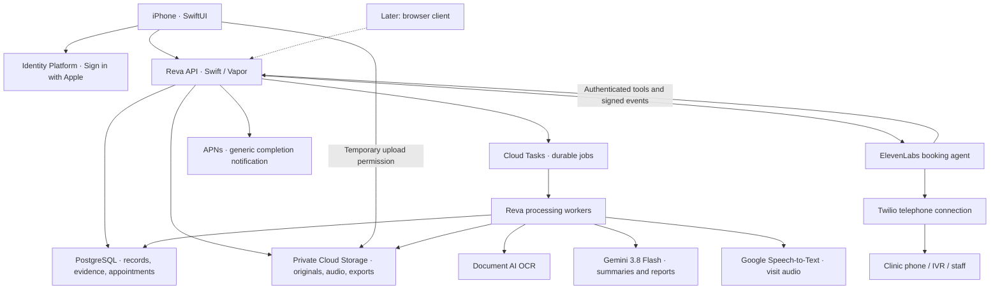

# Reva — full stack specification

**Product:** Reva · **Domain:** revamed.health · **Planning date:** September 12, 2026  
**Status:** Proposed architecture for review. This document authorizes no implementation, provisioning, calls, purchases, or deployment.

## 1. Product and scope

Reva helps a person bring the right medical history and questions to an appointment, then retain what happened afterward. The central experience is **upload → understand → prepare → attend → remember**.

The supplied notebook is a reference for the architecture. The user's written request controls scope where it differs from the sketch. The small database annotation appears to say “Tiger SQL”; this specification interprets it as **Tiger Data / Tiger Cloud PostgreSQL**, pending confirmation of that handwriting. The sketch's local-summary and model-version annotations do not override the requested Gemini summaries.

| Included in the proposed product | Deferred or excluded |
| --- | --- |
| Native Swift iPhone app | Browser interface is a later phase |
| Import PDFs, document photos, images, and text manually | MyChart, Epic, FHIR, and HealthKit connectors |
| Scan multiple pages using the iPhone camera | Custom password-derived encryption system |
| Extract text, structure records, and automatically summarize each item | Claims that data is password encrypted or end-to-end encrypted |
| Medical history and appointment timeline | Diagnosis, prescribing, autonomous treatment decisions |
| Visit-specific reports, source references, and questions | A hospital-wide scheduling API or guaranteed automated booking |
| ElevenLabs agent calls a user-selected clinic to book within approved constraints | Unsolicited calls, automatically moving/canceling existing bookings |
| In-person appointment recording, transcription, and post-visit summary | Capturing arbitrary iPhone cellular-call audio |
| Export/share a clean pre-visit report through the system share sheet | Automatically sending reports to clinicians |

“Making every appointment count” is the strongest initial positioning candidate. “Your medical history shouldn't be a scavenger hunt” is supporting copy. These are working copy options, not a completed brand/style guide.

## 2. Recommended architecture

**SwiftUI iPhone client + Swift/Vapor API and workers + PostgreSQL + Google Cloud file storage, OCR, Gemini, and transcription + ElevenLabs/Twilio booking.** Keep provider integrations behind the server so the later web client can reuse the same workflows and records.

SwiftUI targets Apple platforms. A native SwiftUI app does not become a browser app by putting a wrapper around it. Plan a separate responsive browser frontend later, sharing the API, data contracts, workflows, and design tokens. WebKit embeds web content inside a native app; it does not export SwiftUI to the web. [Apple SwiftUI](https://developer.apple.com/documentation/swiftui/), [WebKit for SwiftUI](https://developer.apple.com/documentation/webkit/webkit-for-swiftui)



The database holds structured facts and pointers; object storage holds source files. A summary is a derived view of a source, never a replacement for it. Appointment reports are versioned snapshots with traceable evidence.

## 3. Stack sheet

| Layer | Proposed technology | Responsibility / rationale |
| --- | --- | --- |
| iPhone application | Swift + SwiftUI; iOS 18+ proposed baseline | Native navigation, document review, capture, report reading, recording. Final minimum OS follows target-device decisions. |
| iOS architecture | Feature modules, Observation, async/await, typed repositories | Separate screen state, domain rules, API clients, and device services. Avoid one global app-state object. |
| Local state | SwiftData for small cached metadata and drafts; protected files for temporary documents/audio; Keychain for sessions | Resume interrupted work. Server remains authoritative; provide an explicit cache-clearing policy. |
| Camera scanning | VisionKit `VNDocumentCameraViewController` | Multi-page scan, page ordering, preview, crop, retake. Bridge the UIKit controller into SwiftUI. |
| Local text preview | Vision `VNRecognizeTextRequest` | Fast preliminary OCR and capture feedback, before the full ingest pipeline finishes. |
| File import and viewing | SwiftUI file importer / document picker, PhotosPicker, PDFKit, Quick Look | Import PDFs/images/text and inspect originals. Full-quality pages are preserved. |
| Report PDF export | UIKit `UIGraphicsPDFRenderer` + system share sheet | Render the structured report on iPhone with controlled typography/page breaks; no server PDF engine needed initially. [Apple PDF renderer](https://developer.apple.com/documentation/uikit/uigraphicspdfrenderer) |
| Audio capture | AVFoundation (`AVAudioSession`, recorder or engine) | Record an in-person visit in recoverable segments; handle interruptions and local playback. |
| API and orchestration | Swift + Vapor | One code language for primary app/backend work; REST/JSON endpoints, access control, report orchestration, booking tools. [Vapor](https://docs.vapor.codes/) |
| Database access | Fluent + PostgreSQL driver; parameterized SQL for retrieval | Migrations and relational data access; explicit queries for source joins and search. [Fluent](https://docs.vapor.codes/fluent/overview/) |
| Database | Tiger Cloud PostgreSQL; PostgreSQL on Cloud SQL is the deployment alternative | Honors the apparent database choice in the drawing. Plain tables suffice initially; no time-series dependency is necessary. Tiger supports PostgreSQL clients and vector search. [Tiger integrations](https://docs.tigerdata.com/integrations/latest), [Tiger search/storage](https://www.tigerdata.com/cloud) |
| Authentication | Google Cloud Identity Platform, Firebase Apple SDK, Sign in with Apple | Managed accounts and tokens; Reva does not implement password storage. Optional email/password can be a later product choice. [Firebase Apple setup](https://firebase.google.com/docs/auth/ios/start), [Apple authentication](https://developer.apple.com/documentation/authenticationservices/implementing-user-authentication-with-sign-in-with-apple) |
| File storage | Private Google Cloud Storage buckets | Original PDFs/images, extracted artifacts, audio, and report exports. Temporary signed uploads/downloads, no public medical-file bucket. [Signed URLs](https://docs.cloud.google.com/storage/docs/access-control/signed-urls) |
| Jobs | Cloud Tasks + private Cloud Run workers | Retryable OCR, summaries, transcription, and reports. Store job state in PostgreSQL. Use OIDC-authenticated queue requests. [Cloud Tasks](https://docs.cloud.google.com/tasks/docs/creating-http-target-tasks) |
| AI | Gemini 3.8 Flash via Google's enterprise cloud model endpoint | Per-document summaries and evidence-based report drafting. Details and model routing below. |
| OCR | Google Document AI Enterprise Document OCR | Canonical page text, positions, reading order, and extraction quality data; local Vision preview complements this. |
| Visit transcription | Google Cloud Speech-to-Text v2, evaluated against local Whisper | Recommended cloud path using the Google ecosystem; local mode remains a separately evaluated option. |
| Telephone agent | ElevenLabs Agents + Twilio phone number | Conversational booking, IVR navigation, and approved backend tools. |
| Calendar and alerts | EventKit UI, UserNotifications, APNs | User-mediated calendar save, local appointment reminders, generic job-completion notifications. |
| Hosting | Containerized Vapor on Cloud Run; separate API and worker services | Independent scale/concurrency, durable work off the phone, authenticated service-to-service access. [Cloud Run](https://docs.cloud.google.com/run/docs/overview/what-is-cloud-run) |
| Secrets and monitoring | Secret Manager, Cloud Logging/Monitoring, structured audit events | Server-only vendor keys; log IDs, timings, and error codes rather than record bodies. |
| Source/build management | Existing GitHub repo; SwiftPM; GitHub Actions; Xcode/TestFlight | Pull request review, reproducible builds, migration checks, device testing. CI artifacts contain synthetic examples only. |

**Database decision:** Tiger is viable technically. Its public security page places HIPAA support on the Enterprise plan; obtain actual plan/contract terms before using it in a deployment that needs that coverage. Google Cloud SQL PostgreSQL offers a more consolidated Google Cloud alternative. Do not run both databases. [Tiger security](https://www.tigerdata.com/security), [Google covered products](https://cloud.google.com/security/compliance/hipaa)

For a Swift server, provider REST APIs are a straightforward baseline. Do not assume Firebase's Admin SDK or every Google service has a first-party Swift server SDK. Validate ID tokens using a maintained JWT library with Google's published signing keys, issuer, audience, expiry, and subject checks, plus the chosen account-revocation/session policy. [Firebase token verification](https://firebase.google.com/docs/auth/admin/verify-id-tokens), [Vapor JWT](https://docs.vapor.codes/security/jwt/)

## 4. Document ingestion and extraction

The product promise should be **every readable item becomes organized, searchable, and summarized, with uncertain text visibly flagged**. No OCR/vision model can promise perfect extraction from all scans, handwriting, tables, or damaged pages.

### Capture and file rules

- Initial accepted formats: PDF, JPEG, PNG, HEIC converted to an interoperable processing image, and UTF-8 text. Treat visit audio as its own intake route. Add DOCX or other formats only with an explicit parser and acceptance tests.
- Camera flow: scan → review pages → reorder/crop/retake → add source/date if known → upload. Give blur, glare, cut-off, and missing-page feedback where detectable.
- Proposed first limits: 50 MB / 100 pages per document and 120 minutes per visit recording. These are product limits to validate, not provider maxima. Larger records should have a clear split/batch flow.
- Preserve the original upload, a checksum, upload timestamp, declared owner, MIME type, original filename, and page count. User-confirmed patient identity must not be inferred merely from a filename.
- Detect duplicates within one user's records using content hashes. A replacement creates a new document version; never silently overwrite the prior source.
- Password-protected or corrupt PDFs enter a specific actionable error state. Do not summarize missing pages as though processing succeeded.

### Processing sequence

1. **Accept upload.** Authenticate, create a document ID, and grant a short-lived upload permission limited to that object's location and allowed properties. Verify the stored object before enqueueing work.
2. **Inspect the file.** Validate file signatures and size, quarantine unsafe/malformed files, and compare stored bytes/checksum. Do not trust file extension or client OCR as authoritative evidence.
3. **Extract per page.** For text PDFs, use usable embedded text while checking reading order and coverage against page images. Use Document AI native PDF parsing on the backend and OCR scanned pages/poor text layers through the same processor. PDFKit can supply a local preview; it is not a dependency of the Linux worker. Mixed PDFs require page-level extraction checks.
4. **Keep layout.** Save page number, text offsets, bounding boxes, tables/cells, units, headings, and extraction-engine/version. The column containing a lab value must remain tied to its test name, reference range, and date.
5. **Check important fields.** Compare drug names, doses, allergies, dates, procedures, measurements, signs, decimals, and negations with their source spans. Flag ambiguity or disagreement; do not let Gemini quietly “correct” the source.
6. **Request targeted review.** Show ambiguous text beside its original page crop. Store the user's correction as a separate revision with provenance. If the page is unreadable, request a rescan and retain the original.
7. **Summarize automatically.** Enqueue Gemini as soon as sufficient text is extracted. Produce a provisional summary for readable portions when useful, clearly indicating excluded or unresolved pages. A failed summary retries without re-uploading the record.
8. **Index and finish.** Save structured summary, source-linked facts, chunks, retrieval metadata, and status. Notify the user generically when processing completes.

Recommended state model: `uploading → uploaded → extracting → needs_review / summarizing → ready / partially_ready / failed`. Every error includes a user action such as retry, rescan page 3, or provide an unlocked copy. “Immediately summarized” means work starts automatically; the UI must show actual progress rather than imply zero latency.

### Stored summary contract

Each document summary contains:

- Document kind, title, author/provider when stated, encounter/document dates, patient-match status, language, and source version.
- A short plain-language summary and structured facts: conditions, symptoms, procedures, implants, medications, allergies, results, follow-up instructions, and unresolved issues.
- Time and status: current, historical, resolved, uncertain; explicit distinctions between patient report, clinician note, and confirmed result.
- Exact medication dose/frequency and lab value/unit/range when present, retaining original wording alongside normalized fields.
- Topic tags and a concise relevance summary for retrieval.
- Source references on every factual item: document/page/text span, or audio timestamps for transcripts.
- Extraction warnings, contradictions, missing dates, and review state.
- Model ID, prompt/schema version, generation time, and content hash for reproducibility.

The formatted record page has a consistent header, concise overview, key facts/results, follow-ups, source links, and expandable original text. It distinguishes **source text**, **AI summary**, and **user correction**. Visually tidy formatting must not alter clinical meaning.

## 5. Visit-specific report generation

### Inputs

Appointment date/time/timezone, clinic/provider, visit type/specialty, primary concern, symptom timeline, user goal, questions already on the user's mind, and optional “include this record” / “exclude from this report” choices. Support a manual appointment entry before any booking connector exists.

### Retrieval in two passes

**Pass 1 — discover relevant records.** For small histories, evaluate all document relevance summaries in one bounded request; for large histories, combine structured filters and full-text search with optional semantic retrieval. Retrieve source IDs and a reason for inclusion, not a finished report. Partition by the authenticated patient's records before any search. Include user-pinned records and an explicit pass over potentially relevant active medications, allergies, implants, and unresolved issues so they are not lost in a narrow topic match.

**Pass 2 — read the evidence.** Retrieve original extracted passages and neighboring context from those records, including tables and page images when needed. Gemini 3.8 Flash then drafts from that evidence. Expand retrieval when a summary indicates another linked episode, an ambiguous claim, or a contradiction. Never synthesize the final report exclusively from lossy summaries.

Semantic embeddings are optional at the first milestone. Start with PostgreSQL full-text search plus summary-based selection and measure misses. Add a versioned embedding provider and `pgvector` only when needed; record model/version/dimensions and reindex on incompatible changes. The final embedding model and endpoint require a deployment-region check before selection.

User examples are useful retrieval scenarios, not absolute clinical rules. Relevance depends on dates, medications, procedures, symptoms, and the visit goal. The system should explain why it included an item and allow the user to correct that choice; it should not encode “broken leg never matters to nausea” as a medical rule.

### Report output

1. Visit purpose in the user's words and what they hope to accomplish.
2. Concise relevant history with dates and source links.
3. Pertinent medications, allergies, procedures/implants, and recent results, with their status and uncertainty.
4. A short timeline of the concern and related care.
5. Questions to ask, prioritized by the user's goal and documented gaps.
6. Items to clarify: conflicting instructions, uncertain chronology, missing records, or unreadable fields.
7. A source appendix and a clearly labeled AI-generated timestamp/version.

Target a readable one-page brief with expandable detail, rather than forcing every history into one dense page. The report helps the patient discuss care; it does not recommend treatment or declare a diagnosis. Distinguish documented facts, the user's own statements, and generated questions.

### Validation and updates

Validate JSON against a schema, resolve every source reference, and check claim support. A valid source ID alone does not prove a claim is entailed. Check doses/units/dates/negation against evidence and evaluate with human-reviewed examples. Do not invent a reassuring conclusion when evidence is missing.

Create immutable report versions linked to input document versions and visit-goal versions. New uploads, corrections, deletions, or a changed visit goal mark the report stale; regenerate explicitly or automatically according to the user's setting. User edits are preserved separately and reconciled, never silently overwritten. Deleted sources are removed from future retrieval and affected reports are flagged or regenerated.

## 6. AI models and provider connectors

The requested model names are present in current official documentation. Configure explicit IDs, and record the ID used on every output; do not use a moving `latest` alias.

| Task | Model / route | Selection |
| --- | --- | --- |
| Per-document summary, structured fact extraction, final pre-visit and post-visit summaries | `gemini-3.8-flash` through Google Cloud | Primary requested model; GA in Google's current catalog. |
| Document kind/tags and optional inexpensive relevance pass | `gemini-3.5-flash-lite` through Google Cloud | Optional optimization after accuracy comparison; not necessary to build the first flow. |
| Booking conversation | Gemini 3.5 Flash Lite through ElevenLabs, subject to account model listing and evaluation | Matches the user's proposed lightweight option and the documented HIPAA model list. If it mishandles menus/constraints, evaluate the allowlisted 3.5 Flash alternative before release. |
| Optional retrieval embeddings | `gemini-embedding-001`, behind a separate Cloud adapter | Use 768 dimensions as an initial proposal, validate chunk sizes, and record versions; no vector index needed for the first small corpus. |

Both requested Flash models support structured output and a 1,048,576-token context with up to 65,536 output tokens. Those are ceilings, not recommended report sizes. Bound retrieval and output for latency, cost, and auditability. [Gemini 3.8 Flash](https://docs.cloud.google.com/gemini-enterprise-agent-platform/models/gemini/3-8-flash), [Gemini 3.5 Flash-Lite](https://docs.cloud.google.com/gemini-enterprise-agent-platform/models/gemini/3-5-flash-lite)

Use **Google Cloud Gemini / Vertex AI**, whose current generative documentation is branded **Gemini Enterprise Agent Platform**. This does not require building a managed autonomous agent. Use server-side authenticated generation requests with JSON schemas; a Swift REST adapter fits the language choice. Prefer the `us` endpoint for an initially US-focused deployment if its residency and availability meet the selected requirements.

The documented US multiregion REST pattern yields `POST https://aiplatform.us.rep.googleapis.com/v1/projects/{PROJECT_ID}/locations/us/publishers/google/models/gemini-3.8-flash:generateContent`. For optional embeddings, Google's Cloud example uses `POST https://us-central1-aiplatform.googleapis.com/v1/projects/{PROJECT_ID}/locations/us-central1/publishers/google/models/gemini-embedding-001:predict`. These hosts differ deliberately: model multiregion and embedding region are separate configuration fields. Embedding input is limited to 2,048 tokens; use one text per request, explicit dimensions, and `autoTruncate: false` so oversized chunks fail visibly. Both calls use server-side OAuth bearer credentials. These routes are documentation-verified; project access has not been tested. [Model endpoint patterns](https://docs.cloud.google.com/gemini-enterprise-agent-platform/resources/locations), [Cloud embeddings](https://docs.cloud.google.com/gemini-enterprise-agent-platform/models/embeddings/get-text-embeddings)

Do not treat the free Gemini Developer API and the enterprise Cloud route as interchangeable for medical records. Developer API terms restrict sensitive submissions on unpaid services and prohibit clinical practice/medical-advice use; Cloud has distinct contracts and data controls. Keep Reva's function focused on organizing records and preparing questions, and validate the selected service's terms for the actual deployment. Cloud says it does not train on customer data without permission, but zero-retention behavior still depends on feature/configuration. Disable optional request/response content logging and avoid public web/Search/Maps grounding for private-record summarization. [Developer API terms](https://ai.google.dev/gemini-api/terms), [Cloud data controls](https://docs.cloud.google.com/gemini-enterprise-agent-platform/resources/zero-data-retention)

### Integration contract inventory

| Connector | API / interface | Input → stored result |
| --- | --- | --- |
| Identity Platform | Firebase Apple auth SDK; server token verification against published Google keys | Sign-in credential → authenticated owner identity and session |
| Google Cloud Storage | Object upload/download and temporary signed permissions | Original file/audio → private object and verified checksum; downloads only after owner check |
| Document AI | `POST /v1/projects/{project}/locations/{location}/processors/{processor}:process` or `:batchProcess`; processor-version variants when pinned | PDF/pages → text anchors, pages, layout, quality flags; track asynchronous operation for batch |
| Google Cloud Gemini | Publisher model `generateContent`; optional streaming for suitable UI output | Bounded source material + schema → validated structured summary/report |
| Google Speech-to-Text v2 | `POST https://speech.googleapis.com/v2/projects/{project}/locations/{location}/recognizers/{recognizer}:batchRecognize` | Cloud Storage audio URI → long-running operation → timed transcript |
| ElevenLabs | `POST https://api.elevenlabs.io/v1/convai/twilio/outbound-call` | Authorized booking request → `conversation_id` and `callSid` |
| ElevenLabs model listing | `GET /v1/convai/llm/list` on the ElevenLabs API host | Account-visible model configuration → validated booking-agent model selection |
| ElevenLabs server tools | Authenticated HTTP calls into Reva's narrow booking tools | Offer/clarification/outcome → validated state transition |
| ElevenLabs/Twilio events | Signed HTTPS callbacks with deduplication | Call status and result → durable booking attempt state |
| APNs | Server notification provider API with token authentication | Job/appointment event → generic push; app fetches private details after authentication |
| EventKit UI | `EKEventEditViewController` | Confirmed appointment → user-reviewed system calendar event |

Use region-appropriate Document AI/STT hosts and keep processor, bucket, and model locations compatible; the API paths above identify the method, not an assertion that every region/model combination works. Pin actual API configuration after console verification. [Document AI OCR](https://docs.cloud.google.com/document-ai/docs/enterprise-document-ocr), [Speech batch API](https://docs.cloud.google.com/speech-to-text/docs/reference/rest/v2/projects.locations.recognizers/batchRecognize), [ElevenLabs outbound API](https://elevenlabs.io/docs/eleven-agents/api-reference/twilio/outbound-call), [ElevenLabs models](https://elevenlabs.io/docs/eleven-agents/api-reference/llm/list)

Apple's EventKit editor supports user-mediated event creation without broad calendar access. Prefer that initial flow; reading a user's calendar to find availability would be a separate permission and product decision. [EventKit access](https://developer.apple.com/documentation/eventkit/accessing-the-event-store)

## 7. Automated clinic calling and booking

**Reva backend → ElevenLabs Agents → Twilio → clinic phone.** ElevenLabs handles the real-time speech/LLM/voice loop. Twilio supplies the telephone number and phone-network connection. A separate Whisper/Google transcription service is not needed inside this call loop. [Native Twilio integration](https://elevenlabs.io/docs/eleven-agents/phone-numbers/twilio-integration/native-integration)

### Booking request and authority

Before starting a call, the user reviews the clinic's number, appointment reason, permitted identity/contact information, provider/location preferences, date windows and timezone, and whether the agent may accept any matching slot. This single approval authorizes the defined booking attempt; do not require another approval for every ordinary step inside those bounds. Out-of-bounds offers, payment, unfamiliar identity verification, or medical triage go back to the user.

The agent introduces itself as an AI scheduling assistant acting for the user. Give it only the minimum approved booking context. Do not send an entire record library just to schedule a visit. ElevenLabs requires AI disclosure at the start of the interaction. [Disclosure requirement](https://elevenlabs.io/docs/eleven-agents/legal/disclosure-requirement)

### Backend tools

| Proposed tool | Backend-enforced behavior |
| --- | --- |
| `get_booking_request` | Return only the active request's approved details. No arbitrary user or document lookup. |
| `validate_offered_slot` | Compare date, timezone, provider, location, and appointment type with the authorized constraints. |
| `record_booking_outcome` | Save a supported confirmed/proposed/waitlist/callback result, with read-back evidence and provider IDs. |
| `request_user_help` | Stop or hand off for decisions outside the request or an uncertain outcome. |

Tool names are Reva design proposals. Use authenticated webhook tools with a narrow booking/session credential; validate all arguments and state server-side. A language model's output cannot grant itself new permissions. [Webhook tool authentication](https://elevenlabs.io/docs/eleven-agents/customization/tools/webhook-tools)

### State and reliability

`draft → authorized → queued → calling → confirmed / needs_user / retryable_failure / failed`

Store every attempt separately. A completed phone call is not proof of a confirmed appointment. Confirmation requires clinic-supported date, time/timezone, location, service/provider, and any confirmation reference the clinic supplies. Read these back during the call. Keep clinic-confirmed bookings distinct from proposed slots and user-entered appointments.

Handle IVR/DTMF, office hours, timezone, holds, voicemail, no-answer, callbacks, transfer failures, and refusal to interact with an agent. Set maximum hold time, call duration, and retry counts. Purchase an inbound-capable number if callbacks are supported; otherwise explicitly collect a safe callback route. Native Twilio is the initial connector; SIP trunking is an alternative for future carrier/PBX needs, not another required dependency. [Twilio/SIP options](https://elevenlabs.io/docs/eleven-agents/phone-numbers/sip-trunking)

Deduplicate **before dialing**. If starting a call times out, reconcile its provider state instead of immediately dialing again. Verify the ElevenLabs webhook signature against the raw body, enforce timestamp freshness, store/enqueue the event, and acknowledge promptly. Apply idempotent transitions to duplicate or out-of-order events. Verify Twilio callbacks using its corresponding signature rules. Keep Reva's database as the durable appointment record. [Post-call webhooks](https://elevenlabs.io/docs/eleven-agents/workflows/post-call-webhooks), [Webhook delivery behavior](https://elevenlabs.io/docs/eleven-api/resources/webhooks)

### Model and account constraints

ElevenLabs' documented HIPAA-compatible model list includes **Gemini 3.5 Flash Lite and 3.5 Flash**, but not 3.8 Flash at the time of this review. Keep the document model and voice model separate. If a custom Gemini endpoint is later required, ElevenLabs accepts a compatible custom-LLM interface; operating that gateway adds latency, streaming/tool-call work, and contractual responsibilities. [Model/PHI restrictions](https://elevenlabs.io/docs/eleven-agents/legal/hipaa), [Custom LLM interface](https://elevenlabs.io/docs/eleven-agents/customization/llm/custom-llm)

Under ElevenLabs' stated PHI terms, use Enterprise with an executed BAA and enabled Zero Retention Mode. ZRM covers eligible API traffic, excluding dashboard/playground traffic; MCP is unavailable in that mode. Use webhook tools and verify which callback fields remain available. Twilio HIPAA Accounts require Security or Enterprise Edition, an executed BAA, and eligible services. These commercial dependencies can outweigh per-minute cost. For a hackathon, controlled calls with synthetic identities to approved test numbers are a distinct milestone. Twilio trial accounts cannot freely call arbitrary clinics. [ElevenLabs zero retention](https://elevenlabs.io/docs/eleven-api/resources/zero-retention-mode), [Twilio HIPAA Accounts](https://www.twilio.com/docs/iam/twilio-editions/hippa), [Twilio trial limits](https://www.twilio.com/docs/usage/trials/try-out-voice)

## 8. Appointment recording, transcription, and memory

The initial recording feature captures an **in-person room conversation using the iPhone microphone**. It does not assume access to normal cellular call audio.

### Recording flow

Open the appointment → show recording consent/permission step → record with a persistent timer and clear pause/stop → recover/save audio → transcribe → review names/numbers and speaker roles → generate a source-linked post-visit summary.

Define the consent flow for the supported places and users before release. Store the user's confirmation and timestamp, make the recording state unmistakable, and provide an immediate stop/delete control. Configure only the necessary microphone/audio background capability; handle device lock, interruptions, route changes, low storage, and app termination. Use recoverable audio chunks rather than risking the entire visit in an unflushed file. Server jobs continue once uploaded; iOS background execution is not an unlimited processing runtime.

### Provider comparison

| Option | What it provides | Decision |
| --- | --- | --- |
| **Google Cloud STT v2, `chirp_3`** | Managed transcription; batch speaker diarization for supported languages/configurations | Preferred cloud candidate. Audio uploads to private storage; backend tracks the batch operation and normalizes timed segments. Confirm language/region support. [Chirp 3](https://docs.cloud.google.com/speech-to-text/docs/models/chirp-3) |
| **Local Whisper through WhisperKit / Argmax Swift package** | Whisper inference on Apple devices; optional separate SpeakerKit diarization | Preferred offline evaluation candidate. Requires model downloads, device/battery/storage benchmarks, and accuracy testing. This is a third-party Swift implementation. [Maintainer repository](https://github.com/argmaxinc/argmax-oss-swift) |
| **OpenAI Whisper API, `whisper-1`** | Managed backend `POST /v1/audio/transcriptions` | Straightforward optional adapter; ordinary Whisper output does not establish speaker roles. [Whisper API model](https://developers.openai.com/api/docs/models/whisper-1) |
| **OpenAI `gpt-4o-transcribe-diarize`** | Speaker/time segments with `diarized_json`; provider-specific chunking/file limits | Optional comparison if diarization quality warrants another vendor. It is separate from Whisper. [Transcription guide](https://developers.openai.com/api/docs/guides/speech-to-text) |
| **Apple `SpeechAnalyzer` / `SpeechTranscriber`** | iOS 26+ local transcription designed for longer recordings | Optional native local candidate on compatible devices/locales. Does not raise the whole app's OS floor unless selected as required. Do not assume diarization. [Apple session](https://developer.apple.com/videos/play/wwdc2025/277/) |

Choose one primary engine after a small representative benchmark; do not integrate all five before the record-to-report experience works. For legacy Apple Speech, local execution requires checking `supportsOnDeviceRecognition` and requesting it explicitly. [Apple on-device support](https://developer.apple.com/documentation/speech/sfspeechrecognizer/supportsondevicerecognition)

Recording locally does not make the entire flow offline if the transcript later goes to Gemini. An offline transcription option changes where speech is processed; a fully offline medical-summary mode is a different, currently unscoped feature.

### Transcript and post-visit output

Store raw transcript, language, timestamps, speaker IDs, user-assigned roles, provider/model version, processing quality flags, and audio provenance. Reassemble recoverable recording chunks for a single cloud diarization job when within provider limits; otherwise explicitly reconcile speakers across requests and apply recording-relative timestamp offsets. Separate chunks' “Speaker A” labels do not necessarily refer to the same person. Speaker labels must not automatically become Doctor/Patient without confirmation. Edits create a new transcript version.

Gemini turns the reviewed transcript into what was discussed, instructions stated during the visit, tests/referrals, follow-ups, and questions left unresolved. Each claim links to timestamped text; medication instructions preserve the actual words and uncertainty. Extracted follow-up tasks require user review. Feed the resulting transcript summary into the same document-memory/retrieval system as an explicitly typed visit record.

Google STT should use the selected cloud data-handling settings; do not opt into speech data logging for an applicable BAA deployment. If the OpenAI adapter is selected, verify the actual account agreement/endpoint eligibility before real-health-data use. OpenAI's endpoint retention table is useful configuration evidence, not proof of Reva's contractual status. [Google configuration guidance](https://cloud.google.com/security/compliance/hipaa), [OpenAI data controls](https://developers.openai.com/api/docs/guides/your-data)

## 9. Backend structure and data model

### Proposed repository organization

This is a future layout only; no app/backend directories have been created for it.

```text
apps/ios/Reva/                 SwiftUI app and feature screens
packages/RevaDomain/           Swift domain types, validators, API contracts
services/api/                  Vapor routes, authentication, access policies
services/worker/               Document/report/transcription job handlers
services/integrations/         Google, ElevenLabs, Twilio, storage adapters
contracts/                     OpenAPI and versioned JSON schemas
prompts/                       Versioned extraction, relevance, report prompts
evals/                         Synthetic fixtures and reviewed expected outcomes
infra/                         Future deployment definitions
docs/                          Planning specifications and design references
```

Start with a modular backend and two deployable processes (API, worker). There is no need for many microservices, a separate vector database, or a general agent framework. Typed adapters make providers replaceable without changing client screens.

### Core entities

| Entity | Key information / relationships |
| --- | --- |
| User and patient profile | Auth subject, profile owner, timezone, preferences; one self-managed profile initially |
| Document / document version | Owner, kind, original object, checksum, dates, state, superseded/deleted status |
| Page / extracted span / chunk | Document version, page and geometry, text offsets, tables, extraction warnings |
| Document summary | Source version, structured summary, model/prompt/schema version |
| Medical fact | Typed fact, raw wording/value, normalized fields, temporal status, supporting spans |
| Appointment | Owner, provider, time/timezone, goal, provenance, booking state |
| Report / report version / evidence link | Visit-goal version, source versions, generated sections, user edits, stale status |
| Booking request / call attempt | Authorization snapshot, allowed constraints, external IDs, outcome, retry state |
| Recording / transcript / segment | Consent record, audio object/segment, timestamps, speaker labels, corrections |
| Job / webhook event | Idempotency key, attempts, lease, state, vendor event ID, error code |
| Audit event / deletion request | Actor, action, object ID, timestamp, deletion progress and retention exceptions |

Every patient-bearing record must be owner-scoped, including evidence joins, exports, jobs, and voice tools. SQL row-level policies can be defense in depth, but API and worker authorization remain mandatory. The server derives owner identity from the token rather than accepting an arbitrary owner ID from the client.

### Proposed Reva API surface

These paths are Reva's planned contract, not existing provider endpoints.

| API | Purpose / result |
| --- | --- |
| `POST /v1/documents/uploads` | Create upload session; return document ID and temporary upload permission |
| `POST /v1/documents/{id}/complete` | Verify upload; enqueue processing; idempotent on repeated completion |
| `GET /v1/documents` and `GET /v1/documents/{id}` | Paginated list / formatted details, processing status, summary |
| `GET /v1/documents/{id}/source` | Authorized, short-lived original-file access |
| `PATCH /v1/documents/{id}/corrections` | Versioned text/metadata correction and dependent reprocessing |
| `DELETE /v1/documents/{id}` | Revoke access promptly; enqueue source/derived-data deletion |
| `POST /v1/appointments` / `PATCH /v1/appointments/{id}` | Manual appointment and visit-goal management |
| `POST /v1/appointments/{id}/reports` | Create asynchronous pre-visit report job |
| `GET /v1/reports/{id}` | Read the versioned structured report; iPhone renders its PDF locally for sharing |
| `POST /v1/booking-requests` | Store approved booking constraints and disclosure scope |
| `POST /v1/booking-requests/{id}/calls` | Start one authorized attempt; unique idempotency key |
| `GET /v1/booking-requests/{id}` | Current status, outcome evidence, proposed or confirmed appointment |
| `POST /v1/recordings` / `POST /v1/recordings/{id}/complete` | Recording metadata, upload session, then transcription job |
| `GET /v1/transcripts/{id}` / `PATCH /v1/transcripts/{id}` | Time-aligned transcript and versioned user correction |
| `GET /v1/jobs/{id}` | Consistent processing state and actionable errors |
| `POST /v1/devices` | Register/rotate APNs device token |
| `POST /v1/account/export` / `DELETE /v1/account` | User-controlled export and account-deletion workflow |
| `/v1/webhooks/elevenlabs` / `/v1/webhooks/twilio` | Provider-signed, replay-protected event intake |

Use ISO 8601 timestamps, explicit appointment timezones, cursor pagination, request IDs, version/concurrency checks, rate limits, and a common error contract. Return `202 Accepted` and a job ID for long work. Retries must not create duplicate reports, uploads, phone calls, or bookings. Provider callbacks are treated as untrusted until authenticated and matched to an existing request.

## 10. Security boundaries without custom encryption

No custom password encryption is included. Use managed transport/storage encryption, managed authentication, scoped access, protected device storage, secret management, and user deletion controls. Do not describe this architecture as password-derived or end-to-end encryption: cloud OCR, Gemini, transcription, and authorized voice services may process plaintext content.

| Boundary | Permitted data |
| --- | --- |
| Identity provider | Account identity; no diagnoses, summaries, or document bodies in custom claims |
| Storage/database | User-authorized originals and derived records, with access separation |
| OCR | Document pages necessary to extract the uploaded record |
| Gemini | Relevant document content for the requested summarization/preparation task |
| Transcription vendor | Consented recording segments for the requested transcript |
| ElevenLabs/Twilio | Minimal approved booking information, not the full medical history |
| APNs and operational logs | Generic status and opaque identifiers; no clinical text in notification payloads or log fields |

For a real-health-data deployment, assess the product's obligations and the actual contracts, features, retention settings, and regions of every processor. Google lists the proposed core services in its HIPAA covered-product program, but application compliance is not automatic. Use synthetic data for engineering/demo work until the relevant account setup is complete. This is a deployment choice to resolve, not a reason to implement the excluded encryption subsystem. [Google covered products and configuration guidance](https://cloud.google.com/security/compliance/hipaa)

Retention is a product decision: define separately how long to keep originals, extracted text, summaries, audio, transcripts, reports, provider-held artifacts, and backups. A reasonable proposal is to delete source audio after transcription review unless the user chooses to keep it; select the actual period before release. Deletion must cover derived facts, search indexes, report caches, exports, provider copies where supported, and eventual backup expiry. Avoid promising instantaneous erasure from immutable backups.

Uploaded documents and transcript text are untrusted content. They cannot change the assistant's instructions, grant access, request outbound calls, or invoke tools. Keep summarization workers tool-free; booking tools accept only validated structured arguments within an existing user authorization.

## 11. Hosting, accounts, and delivery setup

### Names and environments

- `revamed.health`: future public marketing site.
- `api.revamed.health`: future authenticated API and signed webhook endpoints.
- `app.revamed.health`: later browser frontend.
- Separate development and production cloud projects, databases, buckets, model quotas, and phone-agent configurations. A staging environment is useful before external testing.

Domain names are proposed uses of the supplied domain; ownership/DNS access has not been verified and no DNS records have been changed. Use managed TLS with a production-supported front door. Google recommends an external application load balancer for Cloud Run custom domains; the simple Cloud Run domain-mapping feature is still marked preview/not production-ready. Demo testing can use the generated Cloud Run URL. [Cloud Run custom domains](https://docs.cloud.google.com/run/docs/mapping-custom-domains)

### Accounts and configuration inventory

| Account / integration | Required configuration | Where credentials belong |
| --- | --- | --- |
| Apple Developer / App Store Connect | Bundle ID, Sign in with Apple, APNs entitlement/key, app signing, TestFlight; camera/microphone purpose strings | Signing in protected CI/keychain; APNs private key on backend |
| GitHub | Existing repository, PR workflow, branch rules, CI identities | Short-lived cloud federation where available; protected signing secrets |
| Google Cloud | Billing/project, identity provider, Cloud Run/Tasks/Storage/Document AI/model/STT/Secret Manager APIs and quotas | Workload service accounts; avoid downloaded long-lived service-account keys |
| Tiger Cloud OR Cloud SQL | PostgreSQL service, TLS, restricted network access, backups, migrations, chosen service terms | Backend secret/identity only; never shipped inside app |
| Document AI | Region, processor ID and pinned processor version | Worker service account |
| Gemini | Allowed model ID, location/endpoint, quotas, prompt/schema versions | Worker service account; server-side route |
| Speech-to-Text | Region, recognizer/model/language configuration, storage permissions | Worker service account |
| ElevenLabs | Agent ID, approved voice/LLM, number association, tools, post-call event webhook, retention configuration | Secret Manager; no API key in SwiftUI client |
| Twilio | Account/subaccount, outbound-capable number, country permissions, verified caller setup, callback configuration | Provider integration/server secrets |
| DNS registrar | Access to revamed.health, required DNS records and certificates | Administrator access; no registrar credentials in app |

A purchase or key is not needed to review this spec. Verify quotas, regional feature availability, and provider contracts before activation. GitHub Actions can deploy with workload identity federation rather than storing Google service-account JSON keys. [Deployment federation](https://docs.cloud.google.com/iam/docs/workload-identity-federation-with-deployment-pipelines)

## 12. Costs and budget assumptions

Rates below were checked on September 12, 2026 and are budgeting inputs, not quotes. A project-specific budget still needs expected users, pages uploaded, audio minutes, calls/hold time, region, retention, and vendor plan choices.

| Cost item | Published rate / budget treatment |
| --- | --- |
| Gemini 3.8 Flash, Standard non-global Cloud endpoint | Through Dec 31, 2026: $0.825 per million input tokens and $4.125 per million output tokens (including billed reasoning). Published Jan 1, 2027 rates increase to $1.65 / $8.25. |
| Gemini 3.5 Flash Lite, Standard non-global Cloud endpoint | $0.33 per million input tokens and $2.75 per million output tokens. |
| Google STT v2 | Standard starts at $0.016/minute; dynamic batch $0.003/minute with lower urgency. Channels are separately billable. |
| OpenAI Whisper API | $0.006/minute; 60 minutes is $0.36 before Reva's storage/compute. |
| Document AI OCR | Per-page processing; check base OCR and add-ons independently. Use the current price calculator for the selected processor. |
| ElevenLabs calls | Plan/agent minutes plus LLM usage; do not treat a promotional headline rate as total telephone cost. |
| Twilio | Number rental, destination-dependent voice minutes, optional recording, and any required account edition. |
| Database / files / hosting | PostgreSQL plan, Cloud Run CPU/RAM, storage and operations, networking/egress, backups, load balancer, and any enterprise minimums. |

Sources: [Google model prices](https://cloud.google.com/gemini-enterprise-agent-platform/generative-ai/pricing), [STT prices](https://cloud.google.com/speech-to-text/pricing), [Whisper price](https://developers.openai.com/api/docs/models/whisper-1), [Document AI prices](https://cloud.google.com/products/document-ai/pricing), [ElevenLabs agent plans](https://elevenlabs.io/pricing/agents), [Twilio US voice prices](https://www.twilio.com/en-us/voice/pricing/us).

Illustrative inference-only arithmetic at the current 3.8 non-global rate: a document request using 5,000 input and 1,000 **total billed output** tokens costs about **$0.00825**; a report request using 40,000 input and 2,000 total billed output tokens costs about **$0.04125**. Thus 100 such document summaries plus 20 such report calls are about **$1.65**. This excludes OCR, ranking/validation passes, retries, storage, transcription, telephony, enterprise tiers, and any extra reasoning tokens beyond the assumed output total. It is not an estimated complete user bill.

A 60-minute mono visit at Google's listed STT rate is about **$0.96 standard** or **$0.18 dynamic batch**, plus storage and other work. The advertised **$300 Google Cloud credit is a new-customer trial credit valid for 90 days**, not an ongoing speech allowance; eligibility and service restrictions apply. [Google trial terms](https://cloud.google.com/signup-faqs)

Track token/page/audio/call usage per job, cap per-user work and call duration, configure budget alerts, and set service quotas/concurrency limits. Budget alerts alone are not hard spending caps. Reuse summaries by source version and regenerate only affected reports to avoid repeatedly paying to process unchanged records.

## 13. Milestones and acceptance criteria

These are proposed future implementation stages, not work started in this task.

| Stage | Deliverable | Acceptance evidence |
| --- | --- | --- |
| 0 — planning and design | Select dashboard references, confirm database interpretation and initial data/deployment scope; agree schemas and report example | Reviewed spec, real screenshot reference set, chosen design direction |
| 1 — record-to-report flow | Sign in, manual import/camera scan, automatic summary, source viewing, manual appointment, relevant pre-visit report/export | A synthetic end-to-end demo with traceable claims and readable reports |
| 2 — visit memory | Recording, interruption recovery, transcription review, post-visit summary/action items | On-device recording tests and transcript comparisons on representative samples |
| 3 — phone booking | Controlled outbound calls, clinic menus, approved constraints, clear outcome states | Test calls to numbers owned/approved for testing; no duplicate calls/bookings; successful ambiguity/handoff cases |
| 4 — release preparation | Selected processor agreements/settings, accessibility, deletion, App Store disclosures, operations | Tested access isolation, recovery/deletion paths, device matrix, provider configuration review |
| 5 — browser | Separate responsive frontend using existing API | Feature parity targets, browser authentication/upload/recording behavior, responsive design checks |

### Quality gates

- **Extraction:** include scan rotation, glare, faint print, mixed PDFs, handwriting, table alignment, mg/mcg and decimal cases, negative findings, old/current medications, and mismatched patient records. Measure transcription/extraction errors against reviewed source text, including critical-field accuracy. Never claim “perfect OCR” from a small demo.
- **Retrieval:** build synthetic visit scenarios with relevant and irrelevant records, record the expected evidence, and measure whether relevant source material is found. Test that older but relevant procedures and unresolved issues survive ranking.
- **Report:** each factual assertion has valid supporting evidence; unsupported claims are omitted/flagged. Questions must be distinguishable from facts. Preserve conflicting records and make missing evidence visible.
- **Audio:** test accents, background noise, multiple speakers, medication vocabulary, silence, interruptions, low storage, and timestamps. Word-error rate alone is insufficient; inspect names, doses, and numbers separately.
- **Booking:** test busy/no-answer, hold time, IVR, timezone, offered slot outside constraints, duplicate callback, dropped call after apparent booking, and staff refusal to interact with an agent. Unknown outcomes must be reconciled before another attempt.
- **Access and recovery:** negative tests across owners; signed-URL expiry; forged/replayed webhooks; retries after worker termination; stale report invalidation; deletion propagation.
- **UX:** Dynamic Type, VoiceOver, contrast, large tap targets, loading/failure/empty/partial states, readable one-page exports, and a source link that opens the right page or transcript timestamp.

Performance objectives should be measured on a published fixture set. Proposed initial targets: show upload progress immediately, keep list navigation responsive during jobs, and show per-stage processing state. Set numerical OCR/transcription/report SLOs only after representative device and cloud benchmarks; do not sell unmeasured turnaround times.

## 14. Design work to do before implementation

The user selected **Apple Health** as the primary visual reference. Guava is a limited workflow reference, MyChart informs familiar medical labeling, and One Medical is excluded. Follow the [current style plan](reva-style-plan.md). Proposed navigation is **Summary, Records, Visits**, with recording inside the relevant visit and account settings outside the main task flow.

The style plan defines typography, spacing, navigation, cards, evidence presentation, recording controls, processing states, and accessibility targets. Four palettes await user selection; the conversation includes matching screen concepts for comparison. This remains planning, with no app implementation.

## 15. Decisions still open

1. Confirm whether the handwritten database label means Tiger Data, and whether a sponsor/free plan or production plan is intended.
2. Choose the first release context: synthetic hackathon demonstration, personal real-record use, or a broader patient release. This affects provider/account setup and budget, not the basic record-to-report architecture.
3. Confirm target iPhones/minimum iOS, initial document languages, expected handwriting, and approximate pages/audio minutes per user.
4. Select one of the four palette candidates in the Apple Health-led style plan, then review the remaining detailed screen concepts with consistent synthetic content.
5. Evaluate one primary transcription engine and the booking model on representative examples; confirm project quotas, regional endpoints, and enterprise terms before enabling the respective services.

All unverified account access, pricing tiers, domain ownership, and performance targets remain explicit planning assumptions. The completed work in this task is the specification and reference research only.
