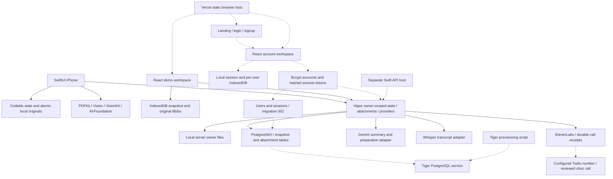

# Reva — current project specification

**Product:** Reva · **Domain:** revamed.health · **Updated:** September 12, 2026.

This is the current product and stack specification. It incorporates the user's later decisions and the Claude Desktop **Reva architecture review** handoff, checked against repository files. The original proposal is preserved in [reva-stack-spec-planning.md](reva-stack-spec-planning.md). The two-hour [MVP goal](mvp-goal.md) and original [completion criteria](completion-criteria.md) describe earlier milestones; they do not defer work the user subsequently requested.

**Status at this refresh:** native and browser demo functionality is committed; real browser accounts, the new landing routes, the Gemini default change, and Tiger provisioning/deployment work are present or underway in an uncommitted implementation workflow. They are active requirements, not a verified live deployment. See the [Claude handoff and evidence ledger](reviews/05-claude-project-handoff.md) for provenance and gaps. A documentation-only checkpoint must not be interpreted as completion of concurrent application work.

## Product and experience

Reva organizes medical history so a person can prepare for an appointment and retain what happened afterward: **upload → review → prepare → attend → remember**. “Making every appointment count” and the medical-history scavenger-hunt idea remain suitable positioning. Reva provides evidence and questions for the user to review; it does not diagnose, prescribe, or autonomously confirm a clinic appointment.

| Area | Current requirement | Delivery status |
| --- | --- | --- |
| iPhone | Native SwiftUI app with Summary, Records, Visits, Medical profile and Settings | Committed MVP; simulator evidence recorded |
| Browser | Responsive React app sharing the native wire contract, with a desktop medical-portal layout informed by MyChart | Committed demo; new public/account routes under integration |
| Intake | Manual PDF/text/image upload, original preservation, extraction preview, correction, supported iPhone scanning | Committed; physical camera checks remain separate |
| Memory | Automatically create a local source excerpt or needs-review state; request a per-document AI summary when configured | Committed local and provider-adapter paths; live provider use unverified |
| Preparation | Visit concern/type/goal, relevant records and pins, source-grounded brief, editable questions/notes, stale-state handling, export | Committed local journey and configured Gemini adapter |
| Medical profile | Persistent identity, allergies, medications, conditions, procedures/implants and care notes | Committed; profile is quick-reference data distinct from source documents |
| Symptom entries | Intuitive self-reported observations with time and optional severity/details; searchable/editable record memory | Committed; replaces an unexplained diary record type |
| Booking | Review clinic/number/constraints, simulate outcomes, optionally initiate a configured consented call and inspect its status | Committed simulation and adapters; no live booking verification |
| Appointment memory | Consent, recording controls, saved original audio, playback, transcription/correction, reusable memory | Committed; physical recording and live transcription remain manual checks |
| Accounts | Real signup/login, hashed passwords, revocable sessions, personal workspace, logout/password/account controls | Newly authorized; implementation and integration review running |
| Tiger | Account-owned snapshots/originals and identity tables in PostgreSQL, setup through Tiger's API, documented API-host configuration | Existing storage adapter; account migration/provisioning extension in progress |

Summary retains the recent-records “View all records” link to Records. The “History stays with you” tile and Appearance setting are removed. Persistent medical information belongs in Medical profile. No automatic MyChart/Epic/FHIR/HealthKit connection is implemented or required.

## Current design authority

Apple Health leads the iPhone design. MyChart informs the desktop browser's familiar medical labeling and spacious portal layout. Guava is a secondary workflow reference; One Medical is excluded. The landing-page direction is minimal and futuristic with a medical identity. Account forms should follow that public-page visual language; the workspace remains consistent with the app.

The user's newer heart-red palette supersedes the earlier six supplied swatches. Both clients currently use light appearance; dark roles in the palette are reserved and are not an implemented appearance option.

| Semantic role | Exact sRGB hex |
| --- | --- |
| Canvas / blush ivory | `#FBF7F5` |
| Surface / white cards | `#FFFFFF` |
| Accent / heart red | `#B84250` |
| Small accent text / deep red | `#8C2F3B` |
| Soft fill / petal | `#FAE6E5` |
| Decorative outline / linen | `#DBCBC9` |

Source of truth: [design/palette.json](../design/palette.json), [style plan](reva-style-plan.md), and [palette review](reviews/04-heart-red-palette.md). The original exact colors (`#FAF4F4`, `#C8A07D`, `#A2B7BC`, `#0A5B6C`, `#6FABB6`, `#E1ECEE`) remain in [palette-supplied.json](../design/palette-supplied.json) for provenance. Use outlined white cards, restrained accent color, clear source labels, readable content widths, visible keyboard focus and accessible form states. Historical responsive checks do not automatically verify the new account pages.

## Actual stack and ownership boundaries

| Layer | Technology and responsibility | Source |
| --- | --- | --- |
| Native UI | Swift / SwiftUI, iOS 18 target; feature folders and focused state extensions | [apps/ios/Reva](../apps/ios/Reva) |
| Native local data | Codable snapshot, atomic JSON replacement/backup, original files | [LocalRepository.swift](../apps/ios/Reva/Core/LocalRepository.swift) |
| Native device work | PDFKit text, Vision OCR, VisionKit scanning, AVFoundation audio, native PDF/share | [Device](../apps/ios/Reva/Device) |
| Browser | React 19, TypeScript 7, Vite 8; dedicated web interface sharing models/contracts | [apps/web](../apps/web) |
| Browser local data | IndexedDB snapshots, revisions and original Blobs; serialized state changes and conflict checks | [browser core](../apps/web/src/core) |
| Browser device work | PDF.js, Tesseract.js with local English assets, MediaRecorder, print CSS | [browser features](../apps/web/src/features) |
| API | Swift / Vapor 4, bounded input/output, owner identity, safe errors, provider adapters | [server](../server) |
| Server local mode | Atomic owner files and a persistent call-receipt directory; new account-file storage under integration | [LocalFileStore.swift](../server/Sources/RevaServer/LocalFileStore.swift) |
| PostgreSQL | PostgresNIO, parameterized transactions, JSONB snapshots, BYTEA attachments, mutation audit; account migration 002 being integrated | [PostgresStore.swift](../server/Sources/RevaServer/PostgresStore.swift), [migrations](../server/Sources/RevaServer/Migrations) |
| Document/visit AI | Server-side Gemini Developer API adapter, structured response validation and supplied-source IDs | [Providers](../server/Sources/RevaServer/Providers) |
| Transcription | Server-side OpenAI Whisper adapter, timed segments, preserved original audio | [VoiceTranscription.swift](../server/Sources/RevaServer/Providers/VoiceTranscription.swift) |
| Calling | ElevenLabs outbound calls and conversation polling through an imported Twilio number | [VoiceCalls.swift](../server/Sources/RevaServer/Providers/VoiceCalls.swift) |
| Browser hosting | Vercel static build; local Node wrapper has a fixed loopback API proxy | [root Vercel config](../vercel.json), [serve.mjs](../apps/web/scripts/serve.mjs) |
| API hosting | Separate persistent Swift service; Docker/Tiger setup extension under integration | [Dockerfile](../server/Dockerfile), [Tiger setup](tiger-setup.md) |

The browser is a separate frontend, not compiled SwiftUI. Neither client connects directly to PostgreSQL or holds provider API keys. SwiftData, Fluent, Firebase/Identity Platform, Sign in with Apple, Cloud Storage, Cloud Tasks, Document AI, APNs, Cloud Run workers, vector search, and Google Speech-to-Text were proposed alternatives; they are not delivered dependencies or mandatory MVP setup.

## Documents, evidence and medical memory

1. Preserve the uploaded original bytes and metadata. Extract text locally, retain page references where available, and expose text/date corrections and unreadable-input warnings. Browser camera picking is not equivalent to the native multipage scanner.
2. Save a versioned record and clearly labeled local excerpt or needs-review state. When connected AI is enabled and text is usable, request its summary automatically. Preserve user edits made while the request runs and label model-generated content.
3. For a visit, use concern/type/goal and pins to select relevant record evidence. Local mode is deterministic retrieval; connected mode uses the implemented Gemini preparation contract. The original proposal's separate embedding/vector/two-pass worker architecture is not implemented.
4. Constrain generated references to supplied record IDs. Clients derive original quotes, page references and versions. An AI overview is not itself an original medical source.
5. Preserve personal questions and notes; source or goal changes invalidate an earlier brief. Exports must respect stale-state warnings. Native export is a paginated PDF; browser export uses print/Save as PDF.
6. Symptom entries are explicitly self-reported. Corrected transcript memory keeps stable source identity for future preparation. Medical profile edits remain distinct from historical document evidence; automatic profile-to-preparation inclusion is not established by the current preparation contract.

Perfect extraction cannot be promised. The required behavior is inspectable originals, visible extraction uncertainty, correction, and no false AI-success state. The demo contains synthetic records and separately labeled sample transcripts; newly recorded audio must never acquire the sample transcript automatically.

## Web paths and account extension

The authoritative detailed implementation contract is [accounts-and-tiger.md](task-specs/accounts-and-tiger.md). These are required behaviors undergoing integration, not a statement that the hosted flows pass.

| Path | Intended behavior |
| --- | --- |
| `/` | Public landing with Log in, Sign up and View demo; recognized session can offer Open your workspace |
| `/demo` | Existing fictional workspace with explicit manual sync; internal pages continue as `#/summary`, `#/records`, etc. |
| `/login` | Email/password login form with bounded requests and visible validation/errors |
| `/signup` | Name/email/password signup form; success enters a personal workspace |
| `/app` | Session-gated personal workspace, separate local data from the demo and other users |
| Older `/#/…` links | Forward to the corresponding `/demo#/…` workspace route |

Current working-tree `main.tsx` contains these account entry routes and imports the real form components. That confirms source presence only: the implementation workflow must still verify forms, session expiry, logout, errors, reloads and hosted deep links.

Account requirements:

- Password hashes use Vapor bcrypt, cost 12 by default, off the event loop. Policy is 10–72 UTF-8 bytes, no CR/LF, not equal to email; passwords are not silently trimmed. This is account authentication, distinct from the excluded custom document-encryption feature.
- Opaque sessions use random `rs_` tokens; only a SHA-256 token hash is stored on the server. Expiry/revocation are checked per request, with a default 30-day lifetime and a 20-live-session cap. Email/password login throttling is bounded and per server process.
- Static `REVA_TOKENS` identities remain supported for existing native/developer transport. New accounts authorize data/provider requests with their account owner ID. Native signup/login UI is not delivered by this browser account task.
- The browser stores account session data under `reva.session.v1` in localStorage. Account-mode IndexedDB is per user (`reva-account-<hash>-v1`); the demo keeps its separate database. The historical memory-only bearer statement applies to developer/demo configuration, not the new persistent account session.
- A new personal workspace begins empty or pulls existing account data. It must not seed fictional medical records. Account-mode local commits schedule a push after a 1.5-second debounce; conflicts require explicit pull/reconciliation, failed sync must preserve local data, and a 401 clears the session and redirects to login. Native and demo sync remain explicit.
- Account settings include logout, logout everywhere, change password, and explicit account deletion. Password changes revoke other sessions; deletion must remove user/session and owned snapshot/attachment/audit data as specified. Persistent call receipts have separate replay-protection semantics that need explicit review.

| HTTP route | Identity | Contract |
| --- | --- | --- |
| `POST /v1/auth/signup` | Public | Create account and return session; honor signup policy/duplicate email |
| `POST /v1/auth/login` | Public | Authenticate and return session; generic invalid-credential response and throttling |
| `GET /v1/auth/session` | Bearer | Inspect account/session or static-token identity |
| `POST /v1/auth/logout` | Account session | Revoke current session |
| `POST /v1/auth/logout-all` | Account session | Revoke all account sessions |
| `PUT /v1/auth/password` | Account session + current password | Change hash and revoke other sessions |
| `DELETE /v1/auth/account` | Account session + password | Remove account and specified owned data |

The new public auth routes are the exception to older “all `/v1` routes require a bearer” language. Existing state, attachment and provider routes remain authenticated. Reset-by-email, email verification, OAuth, MFA and native account screens are not claimed implemented.

## Storage, providers and configuration

Existing PostgreSQL tables store owner snapshots (`reva_owner_state`), original attachments (`reva_attachments`) and mutations (`reva_mutations`). Migration `002_accounts.sql` adds `reva_users` and `reva_sessions`. The account store protocol is implemented by local-file and PostgreSQL adapters with bounded operations. Local account persistence uses `.accounts.json`; database migrations are ordered and transactional. Live Tiger migration/round-trip verification is still a separate gate.

| Existing connector/API boundary | Function and authority |
| --- | --- |
| `/v1/state` and `/v1/attachments/*` | Owner-scoped snapshot/original transfer with revisions; conflict handling stays explicit |
| `GET /v1/providers` | Report configured capabilities and selected model; configuration is not proof of a successful live request |
| `POST /v1/ai/summarize` | Bounded record text → validated per-record summary and model label |
| `POST /v1/ai/prepare` | Visit context and candidate records → overview, questions and allowed source IDs; clients build original citations |
| `POST /v1/audio/transcribe` | Original audio → timestamped Whisper segments; 16 MiB input limit; preserve original codec metadata, including browser WebM/Ogg |
| `POST /v1/booking/call` | Explicitly consented reviewed request; persist owner/request intent before dialing; replay or uncertain outcome must not automatically redial |
| `GET /v1/booking/call/:requestID` | Owner-only conversation polling; completion is not automatic appointment confirmation |

The provider contract is documented in [mvp-api-contract.md](task-specs/mvp-api-contract.md), with newer account/audio changes noted at its top. Provider callbacks and durable cloud job queues are not required by the implemented polling-based MVP.

| Configuration | Scope and role |
| --- | --- |
| `REVA_STORAGE`, `DATABASE_URL` | Server local/PostgreSQL selection and TLS database connection |
| `REVA_HOST`, `REVA_PORT` | API listener; browser hosting alone does not run Vapor |
| `REVA_DATA_DIRECTORY` | Persistent server file location, including call receipts even in PostgreSQL mode; preserve across redeployments |
| `REVA_TOKENS` | Existing static owner identities; optional with the account identity path under its configuration rules |
| `REVA_ACCOUNTS`, `REVA_SIGNUP`, `REVA_SESSION_DAYS` | New account enablement, registration policy, session lifetime |
| `REVA_ALLOWED_ORIGINS` | New exact-origin CORS allowlist for hosted browser-to-API requests |
| `VITE_REVA_API_ORIGIN` | Public browser build-time API origin; never a credential |
| `GEMINI_API_KEY`, `GEMINI_MODEL` | Server summary/preparation adapter; current uncommitted default is `gemini-3.8-flash` |
| `OPENAI_API_KEY`, `OPENAI_TRANSCRIPTION_MODEL` | Server transcription; implemented timestamped contract currently accepts `whisper-1` |
| `ELEVENLABS_API_KEY`, `ELEVENLABS_AGENT_ID`, `ELEVENLABS_PHONE_NUMBER_ID`, `REVA_ENABLE_LIVE_CALLS` | Configured agent/number and explicit live-call gate |
| `TIGERDATA_ACCESS_KEY`, `TIGERDATA_SECRET_KEY`, `TIGERDATA_PROJECT_ID` | Provisioning-script credentials, separate from application `DATABASE_URL` |

The model names above describe repository configuration, not proof of model availability, free-tier entitlement, or live API success. The handoff keeps Whisper as the current speech path and discusses other models as future/dashboard choices; Reva does not silently switch its implemented transcription contract. ElevenLabs agent model/prompt settings are configured in that service, not enforced by the current outbound adapter.

Tiger's provisioning script targets its REST control-plane API and requests a shared service by default with an explicit paid-size guard. Runtime medical data uses PostgreSQL through the Swift server, not the provisioning API. The setup script, Dockerfile and guide must be validated before treating the deployment as connected. No live service creation, credentialed provider call, clinic call or production database operation was performed by this spec refresh. Ignored `.env` values were not inspected.

## Hosting and verification gates

The committed root Vercel configuration (`cfe0997`) selects the browser install/build/output paths from the repository root. The account/landing work also edits `apps/web/vercel.json` and pathname fallbacks. Integration must reconcile the deployed root/config, all five pathname routes, asset locations and CSP allowance for the configured external API origin. A successful Git push or Vercel build does not establish that deep links, authentication, API CORS or database persistence work.

Before the account/Tiger extension is marked complete, require:

1. Swift and web builds plus focused account tests: registration, duplicate account, incorrect password, lockout, expiry/revocation, password change, session cap, owner separation and deletion.
2. Local browser/server end-to-end: empty personal signup, data persistence after reload, separate demo/account state, multiple users, autosync conflict/error recovery, 401 redirect and logout.
3. Public routes and responsive account pages: direct navigation/refresh at `/`, `/demo`, `/login`, `/signup`, `/app`; keyboard/form accessibility, mobile layout and correct API-origin handling.
4. Deployment-specific evidence: API container build/run, HTTPS/CORS/CSP compatibility, Tiger TLS/migrations and owned state/original/session round trip. Until credentials and a real service are tested, keep these Unverified.
5. Independent review findings adjudicated with exact source identity and reproducible evidence. The broad Fable review snapshot predates most account implementation; completed account code needs its own finished checkpoint or isolated delta review.

Historical verification is preserved in [web-client.md](verification/web-client.md), [verification index](verification/README.md), and [build history](build-progress.md): native/server tests and simulator build, browser unit/wrapper checks, and 25 route/viewport combinations. Those results cover their recorded pre-account checkpoints. They are not fresh account tests. The implementation chat reports its early landing state passed typecheck, 77 Vitest tests, 7 wrapper tests and formatting; this refresh did not rerun them.

## Collaboration and review process

Feature work remains separated into records/profile/preparation, visits/booking/audio, and server/providers/storage, with shared DTO/store/theme/project changes coordinated by an integration owner. The account workflow assigns server, browser, and deployment files to three implementers. Follow [team-workflow.md](team-workflow.md) and [coding-standard.md](coding-standard.md): purpose/inputs/outputs/side-effects headers and named logical blocks, useful contracts rather than comments that repeat each line. “NASA-style” is a clarity and discipline request, not a certification claim.

The user subsequently requested a major Fable 5.1 Ultracode audit, superseding the earlier two-hour restriction on exhaustive review. The separate Claude chat **Reva intensive code-review workflow** received [67 checks and 19 worker task packets](audits/fable-20260912-114322/START-HERE.md), covering 16 source reviewers, one shared evidence runner and two validators plus its supervisor. Review workers produce findings without changing application code. Preserve the frozen snapshot; use isolated worktrees for completed-code delta reviews. Audit evidence must distinguish WIP, source-proven defects, reproduced failures and unverified services.

This collaborator retains the user's checkpoint/push workflow and records documentation changes separately from Claude's uncommitted implementation. The other Claude workflow is configured to leave its application changes for review rather than committing them. Do not stage its unfinished files with a documentation update.

## Full-stack interaction map

Solid arrows represent implemented baseline code interactions, including provider adapters rather than proof of live provider use. Dashed links mark account work or external deployment/configuration that still requires integration or live verification.

MyChart import, custom password-derived document encryption, automatic clinic confirmation, cellular-call interception, managed cloud processing queues, and production medical-data certification remain outside implemented scope. Live account/provider configuration and physical-device/hosted verification remain explicit setup gates; they do not justify calling unfinished local account functionality complete.
