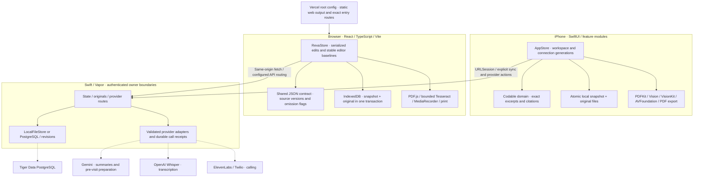

# Reva audit repair log

## Scope

User authorization: fix all 23 confirmed audit findings using simultaneous Astra agents at xhigh effort, with precise changes and no unnecessary expansion. Baseline: `98261b86cb7f87920972873775074d34bfaaade4`. The [audit report](../audits/fable-20260912-114322/FINAL-REPORT.md) remains historical evidence of the frozen defects; this log records their repair and verification.

Unfinished account/Tiger work in the shared checkout is preserved separately. Repair branches start from the published baseline, and overlapping changes are reconciled explicitly. This work does not complete or release that unrelated account implementation.

## Parallel ownership

| Branch | Owner | Assigned findings |
| --- | --- | --- |
| `fix/audit-native-20260912` | Astra, xhigh | 10-001, 03-001, 04-001, 04-005, 05-001, 05-002, 05-008, 04-004 |
| `fix/audit-evidence-20260912` | Astra, xhigh | 02-002, 02-005, 02-004, 02-006, 05-004, 07-001, 04-006, 04-007, 04-008 |
| `fix/audit-browser-20260912` | Astra, xhigh | 08-001, 07-002, 14-001, 14-002, 16-001, 16-002 |
| `fix/audit-integration-20260912` | Coordinator | Independent review, integration, generated project membership, combined checks, WIP reconciliation and delivery |

The native owner controls shared AppStore methods and recording lifecycle. The evidence owner controls native/browser domain rules and extraction. The browser owner controls its editors, original-attachment transaction, accessible navigation and deployment/build instructions. Shared call-site/API changes are coordinated before integration.

## Checkpoints

- Created four isolated worktrees from the published baseline. The original audit worktree remains unchanged.
- Preserved a local binary patch and first-party untracked-file backup of the shared checkout before repairs; ignored credentials and local Claude workflow state are untouched.
- Reused separate filesystem clones of the audit's browser dependencies after verifying identical lockfiles. No dependency upgrade is part of these repairs.
- Agents make focused commits; the coordinator reviews and integrates them before the final test pass.

## Verification policy

Data-loss, async identity, extraction and CAS fixes require meaningful production-logic regression checks. Small palette/label changes receive targeted source/UI verification. The coordinator runs the combined native/browser builds and relevant suites after integration, avoiding competing global builds. Existing live user services are preserved.

Final results, commit references and any remaining device/live-service verification limits will be recorded below and in the per-finding status sheet.

## Repair result

All **23 confirmed findings (14 P2, 9 P3)** have code repairs. The [per-finding checklist](audit-repair-status.csv) records their commits, executed checks and remaining verification limits. The original 74-item audit remains unchanged: this repair pass does not silently close its unverified candidates, manual gates or unrelated work in progress.

- [Native evidence](evidence/native-audit-repairs.md): asynchronous identity, field-specific editor merges, startup recovery, visit ordering, busy feedback and recording recovery.
- [Extraction evidence](evidence/extraction-audit-repairs.md): exact source passages, omission metadata, demo-wrapper boundaries, relevance/date logic, mixed PDFs, scan classification and palette.
- [Browser evidence](evidence/browser-audit-repairs.md): atomic record/original commits, concurrent brief editing, tablet accessible names, selection contrast and deployment/build configuration.

No dependency upgrade, new paid service, broad backend rewrite or account release is included. Older report citations without omission metadata now request regeneration. Existing source signatures remain unchanged.

## Combined verification

The integrated production code at `1f4b50e` passed the following checks; later checkpoints add evidence documents, the real-wire assertion and the user's queued UI feedback.

| Check | Observed result |
| --- | --- |
| Root `swift test -j 4` | 52 discovered, 51 passed, 1 opt-in localhost test skipped; zero failures |
| Native repair harness | All eight assigned findings; 60 stale-response cases plus normal controls; editor/save/audio recovery assertions passed |
| Optimization harness | Six groups passed; unchanged retry required system temporary-directory access |
| PDFKit/Vision harness | Real mixed header/raster extraction and the ten-page OCR cap passed |
| Browser typecheck, full tests, production build | Passed; 11 test files / 97 tests; 1,925 bundled modules with no build warning |
| Browser static-host tests | Seven passed |
| Browser build assets | All 15 native resource files byte-identical in built demo; local OCR worker/model/WASM present; temporary UI fixtures absent |
| Native Xcode build | Generic iOS Simulator, arm64 and x86_64, signing disabled: BUILD SUCCEEDED |
| Backend and real native client | Fresh backend build; localhost test passed separately, including full snapshots, new `excerptOmitted: true`, nine original files, auth, owner isolation, stale revisions and deletion tombstones |
| Structure / formatting | 71 Swift and 55 browser sources satisfy contracts/sections; 20 changed native Swift files and browser Prettier passed |

The backend's initially copied module cache rejected its old absolute worktree path. Removing only that integration-worktree cache and rebuilding resolved it. The Xcode build's App Intents metadata warning reflects the absence of an AppIntents framework dependency; it was not a compiler failure. Original user services were left running; the real-wire test owned and removed its temporary server/data.

Computer verification used the actual rendered browser editor at a measured 768-pixel viewport with controlled persistence/provider transport. It confirmed late generated questions survive notes-only edits, conflicting notes reject the entire save, all six rail actions retain accessible names, and selected text has 8.124:1 contrast. This pass did not verify other browser engines, physical microphone/camera behavior, real codec interruptions, a newly rendered UIKit PDF, hosted Vercel settings or paid providers. Browser OCR tests use real PDF.js with controlled recognition; native printed-text OCR was executed with real Vision. These results do not promise perfect OCR.

Local raw test logs are under `/private/tmp/reva-integrated-repair-checks` and the agent-specific `/private/tmp/reva-*` paths; the durable evidence is summarized in the versioned documents above.

## Stack and collaboration after repairs

The product architecture remains the [as-built stack](../architecture.md). The diagram below shows where the repaired boundaries sit. External adapters require configuration; this repair pass did not activate their services.

Three Astra agents at xhigh owned separate native, extraction and browser branches. A fourth worktree integrated their focused checkpoints and cross-reviews. Review caught an additional late audio callback that replaced terminal recovery guidance; its regression fails against the previous implementation and passes with the final guard. The separate worktrees remain available for targeted review; the frozen audit source was never edited.

## Shared checkout preservation and follow-ups

Before integration, a local backup captured the newest **59 tracked edits and 24 first-party untracked files**, including account/Tiger work and the user's separate demo/review-removal and native-tab changes. The backup is `/private/tmp/reva-before-integration-latest-20260912`; recovery stash `069e18c222d1c5da0c88ca7735c92dd157a1b93b` is retained. An earlier pre-repair backup also remains. Credentials, ignored files and `.claude` workflow state were excluded from stash operations and left untouched.

Main was fast-forwarded to repair checkpoint `9eeba19`, then the exact stash was applied. Overlaps are reconciled explicitly, preserving newer user intent while retaining the audited data-integrity repairs. The duplicate untracked `apps/web/vercel.json` is removed in favor of the root configuration; its prior contents remain backed up. Restored feature work stays uncommitted and is not silently included in the repair release.

The new annotated browser requests are queued in [UI follow-ups](../ui-todo.md), linked from the project task list. They are pending, rather than implemented as part of this repair pass.
