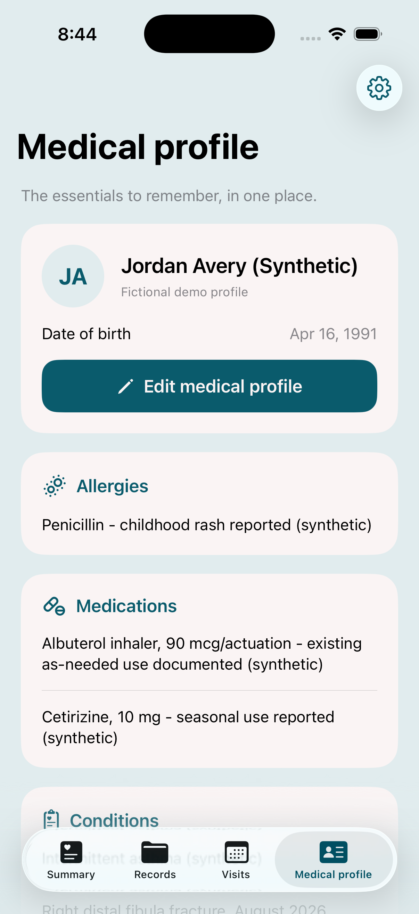

# Medical profile and symptom log verification

September 12, 2026 · implementation checkpoint `ffcbf6c`.

## Implemented behavior

- Medical profile is a fourth tab and the destination of the Summary avatar. It displays and edits name/date of birth, allergies, medications, conditions, surgeries/implants, and care notes. Empty medical fields say “Not provided.” Optional added fields decode old snapshots. Settings is reachable by the profile gear; Appearance and health lists are removed from Settings.
- Summary has Log symptoms and a View all records footer attached to Recent records. The footer switches to Records, resets search/filter/navigation state, and shows the full list. The “Your history stays with you” tile is removed.
- The symptom form accepts a required symptom and occurrence date/time, with optional severity, details, duration, possible triggers, and what helped. It saves a User symptom entry with self-reported provenance. Edit preserves record ID and upload time; canonical source changes advance versions and invalidate previous briefs. Records offers a Symptoms filter and a direct Log symptoms action.
- The old diary item was an imported fictional scan, not an in-app diary. Its untouched demo title now says “Scanned symptom note - date needs review.” Its original scanned wording and ambiguous date remain intact.
- The exact six-color palette is preserved. Opaque Sky `#E1ECEE` now fills the page behind Ivory `#FAF4F4` cards. Explicit sRGB values are used. The prior screenshot's blue cards already measured exact Sky; this update changes the color roles as the stated default after requesting the user's preference.

## Executed checks

| Check | Result |
| --- | --- |
| Xcode simulator Debug build, final integrated source | Passed; `/private/tmp/reva-profile-symptoms-build.log` |
| Root Swift package suite | 44 registered, 43 passed, one opt-in live-server test skipped; no failures. `/private/tmp/reva-profile-symptoms-tests-final.log` |
| New profile tests | Three passed: old schema decoding, durable profile fields while retaining records/visits, unspecified empty fields |
| New symptom tests | Six passed: required/optional fields, invalid input rejection, exact wording/time zone, edit identity, old/new snapshot persistence, relevant citations and stale briefs |
| Native profile flow | Opened via Summary avatar, edited a temporary fictional care note, saved and observed it after relaunch, then cleared it. Existing allergy/medication/condition information and DOB remained visible. Corrected an avatar-initials issue found by this test. |
| Native Settings | Service controls visible; no Appearance or medical-history sections |
| Native symptom flow | Created “QA nausea” with mild severity and fictional details; saved to Recent records; filtered to Symptoms; opened entry, added a 10-minute duration, saved, and saw the same details after relaunch |
| Saved-state check | Exactly one temporary symptom record, version 2 after edit, saved duration and profile note present |
| View all records | Opened full 10-record list after creating a QA entry; repeated from a Symptoms-filtered detail screen and observed All selected and the full list |
| Cleanup | Deleted only the temporary QA entry and cleared only the temporary profile note through the app; original source records preserved |
| Palette pixels | Final Medical profile screenshot contains 1,007,451 exact Sky pixels and 1,327,155 exact Ivory pixels |

The relevance test initially failed because the generic word “symptom” matched every entry's format label. Adding generic entry terms to the existing stopword set fixed the regression: a nausea-focused visit selects the nausea observation without selecting an unrelated ear-pain entry.

## Scope boundaries

Medical profile is persistent quick-reference information. It does not automatically overwrite historical documents or feed the current records-only preparation contract. Symptom entries do participate in that contract because they are versioned MedicalRecords. The backend's JSON snapshot storage preserves the optional profile and symptom fields; no new endpoint or provider credentials were required. No paid API request or clinic call was made. Backend code did not change in this follow-up. Physical-device and larger-text review remain part of the user's manual feedback loop.
