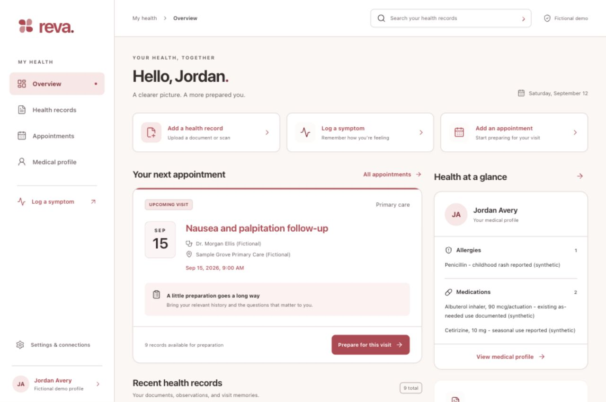
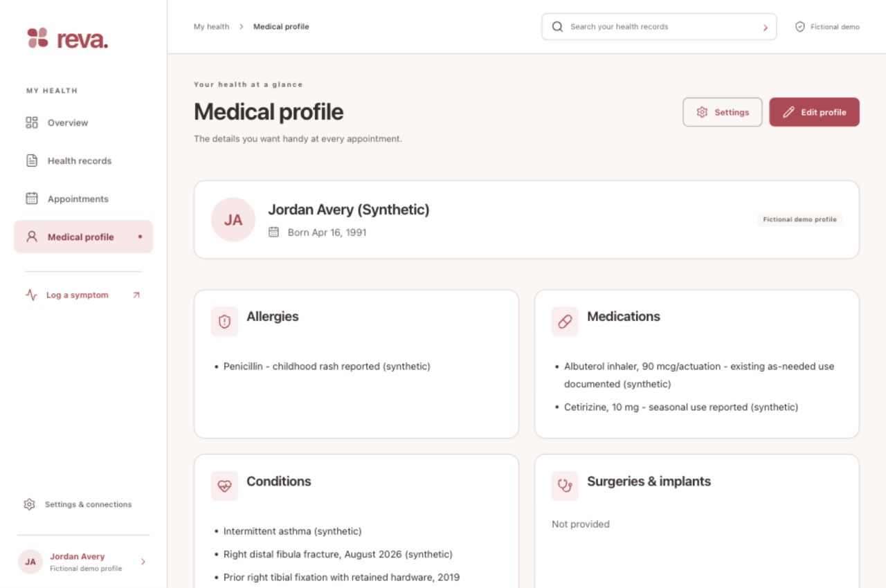

# Browser extension verification

September 12, 2026 · implementation `2640360` · native/audio `480bdae` · selected palette `678e742`.

The browser is a dedicated React interface using Reva's existing native JSON/API contract. It is locally served, not deployed to revamed.health. Tests and UI checks used fictional fixtures only. No live AI, transcription provider, clinic call, or Tiger database was invoked.

## Automated checks

| Check | Result |
| --- | --- |
| Browser Vitest | 77 passed across 7 files: native signature/relevance, IndexedDB atomicity, corruption, cross-tab revisions, API validation, sync conflicts, provider races, call intent, visit edit concurrency, timezone conversion, and microphone lifecycle |
| Production HTTP wrapper | 7 Node tests passed with temporary assets and a loopback mock: fixed destination, forbidden URL/traversal, route/method allowlist, auth and original binary bytes, response header filtering, declared/chunked limits, static confinement and symlinks |
| TypeScript and Vite production build | Passed; main JavaScript about 387 KB / 116 KB gzip; PDF/OCR libraries and workers load separately when used |
| Native Swift tests | 43 passed; 1 explicitly gated real-server test skipped in this run |
| Swift server tests | 30 passed; 1 live PostgreSQL test skipped; parameterized WebM/Ogg transcription tests retain filename, MIME and exact bytes |
| Native Xcode simulator build | Passed with the selected heart-red patch and browser-audio interoperability changes |
| Formatting and structure | Prettier, modified Swift formatting, Git whitespace check passed; 71 Swift and 50 browser source files have responsibility contracts and named sections |

Reproduce the browser checks from `apps/web` with `npm ci`, `npm test`, `node --test scripts/serve.test.mjs`, `npm run format:check`, and `npm run build`. Run `python3 scripts/check_code_structure.py` from the repository root. HTTP tests open only temporary loopback listeners. Earlier native real-client/Vapor checks remain in the historical verification sheet.

## Observed browser journeys

The production build at port 4173 was checked through the Codex in-app browser, with React development hot reload absent.

- Imported the bundled fictional laboratory PDF. PDF.js extracted the source text, including hemoglobin 13.4 g/dL, potassium 4.1 mmol/L and TSH 1.62 mIU/L. Saved a reviewed record, corrected its source date with keyboard input, and opened its unchanged original PDF from local storage.
- Imported the fictional scanned symptom image. Local English Tesseract assets loaded under the production content policy. OCR returned readable text and an imperfect obscured date. The record remained **Needs review**, with an explicit original-comparison warning; no perfect-extraction claim or inferred date.
- Generated the orthopedic local brief. It cited the historical implant inventory on **page 2**, retained source IDs/versions and personal questions, and excluded the unrelated ear-infection record. Plain text that exactly duplicates its cited passage is shown once; distinct generated overviews stay visible.
- Ran the explicit booking simulation through review, queued state, proposed time and the simulated-time action. The app returned to the existing three-visit list. No clinic was contacted.
- Loaded the explicitly fictional September 8 transcript, corrected its introductory segment, saved memory to Records, and verified the correction, timestamps/speaker labels and link back to the original visit.
- Created a structured symptom entry and edited Medical profile care notes in the development build; both persisted through full reload. These QA edits stayed in browser-local storage, with no server push.
- Checked the real local Swift server through the same-origin production proxy: server revision displayed and all unconfigured provider services showed **Not set up**. Live AI remained disabled. Actual browser push/pull against a persistent real owner was not performed; the suite covers request, conflict and persistence behavior with injected responses.
- Verified native-dialog Escape dismissal and narrow-screen form scrolling. Source pages, records and settings have semantic labels. Added an explicit label to the header settings/status link when its visible text is hidden at tablet widths.
- Restored the production browser to the original 9-record, 3-visit fictional dataset through its explicit reset flow. No server or native data changed. No production console errors were observed after switching to the built preview. Earlier wholesale development-module replacement produced transient HMR errors; a reload cleared them before production testing.

## Responsive pass and palette

Each of Overview, Records, Visits, Medical profile, and Settings was independently checked at **375, 768, 1024, 1440 and 1920 CSS pixels**, waiting for its matching heading before measurement. All 25 combinations had document width equal to viewport width, with no main-content element extending outside the viewport. Raw evidence is in [web-responsive-metrics.json](web-responsive-metrics.json). Additional screenshots cover a 1280-pixel desktop and a 375-pixel symptom editor.

Desktop uses a persistent navigation rail, search header, grouped health cards and two columns where space permits. Tablet collapses supporting columns, and phone uses stacked content, bottom navigation, full-width controls and bounded scrollable dialogs. The arrangement is informed by [MyChart's organization of records and appointments](https://www.mychart.org/Features), while colors and components use Reva's selected identity.

Computed browser tokens match `design/palette.json`: canvas `#FBF7F5`, surface `#FFFFFF`, accent `#B84250`, accent text `#8C2F3B`, soft `#FAE6E5`, hairline `#DBCBC9`. Browser functional neutral text/border colors are separately named. The earlier teal palette is historical provenance in `design/palette-supplied.json`.

### Captures

[Phone overview](screenshots/web-phone.png) · [Phone symptom entry](screenshots/web-phone-symptom.png)

## Manual follow-up boundaries

Safari/Firefox and physical camera/microphone hardware were not exercised. MediaRecorder's permission/race/cleanup paths have deterministic tests; real codec playback depends on the destination browser or iPhone. Browser print styles and freshness gating are implemented, but a final system print-to-PDF artifact was not captured in this pass. HTTPS hosting, live provider credentials and production operational review remain separate setup. There is no service worker: IndexedDB preserves data, but an offline app launch still needs previously available application assets. Browser site-data clearing removes its local copy.

Document extraction remains bounded to 16 MiB, 24 PDF pages and 120 KB of extracted text, with original bytes retained and incomplete results flagged. Connected operations never run automatically on a timer. The [compatibility document](../../apps/web/src/core/COMPATIBILITY.md) records Unicode/timestamp and attachment-before-snapshot sync tradeoffs.
